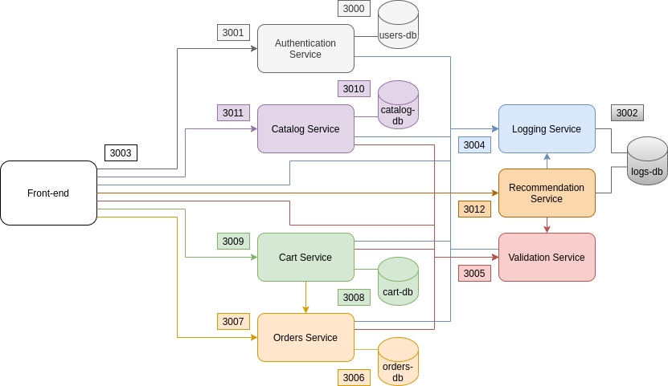

# DOCUMENTATION

## Project part A

### Architecture

Our back-end is composed of 7 microservices : 

1. The `cart` service: \
    This microservice has for goal to handle operations in order to stock the cart of each user in the cloud. It provides operations allowing a user to add and remove products in his cart, checkout his cart and retrieve the content of his cart. See the documentation [CART.md](./project/src/back-end/cart/CART.md).

1. The `catalog` service: \
    This microsevice has for goal to handle the operations in order to add, modify, delete or get the different products in the catalog. The catalog is where all the products of the application are stored and managed. See the documentation [CATALOG.md](./project/src/back-end/catalog/CATALOG.md).

1. The `logging` service: \
    This microservice has for goal to keep a trace of all the operations performed by the users in the other microservices. It also records the performances of all the operations. See the documentation [LOGGING.md](./project/src/back-end/logging/LOGGING.md).

1. The `orders` service: \
    This microservice has for goal to enable users to stock and access their orders. This means that a user can access his past orders from different devices. In other words, it is like a purchases history. See the documentation [ORDERS.md](./project/src/back-end/orders/ORDERS.md).

1. The `recommendation` service: \
    This microservice has for goal to propose recommendations of products. We have 3 types of recommendations, a principal and to supplementary: 
    - a recommendation for a specific user (this the principal recommendation)
    - a recommendation specific to an item
    - a list of the best-sellers (most bought products) 
    
    See the documentation [RECOMMENDATION.md](./project/src/back-end/recommendation/RECOMMENDATION.md).

1. The `users` service: \
    This microservice has for goal to handle operations in order to register and authenticate the different users. It is also known as the `authentication` service. See the documentation [USERS.md](./project/src/back-end/users/USERS.md).

1. The `validation` service: \
    This microservice has for goal to check if a user has correctly been authenticated. It uses the the username, the role and the token provided by the user to check the validity of request. See the documentation [VALIDATION.md](./project/src/back-end/validation/VALIDATION.md).

### Microservice documentation

A precise documentation can be find in the folder of each microservice. Those folder can be find at `project/src/back-end/<name of microservice>`. There, you will find a markdown file (`<NAME OF MICROSERVICE>.md`) containing the documentation of the microservice.

**Note:** When we talk about a product, note that it is a JSON object that must at least contain the following fields: 
- `id`: this is a number identifying the product (it is unique). This number is automatically given to the product when creating it from the front-end (= adding it in the catalog). But if you want to test the back-end alone, you need to specify this id in the requests (as shown in the microservices documentation).
- `name`: this a string representing the name of the product. This is the name you enter in the front-end when creating/modifying the product.
- `category`: this a string representing the category to which the product belongs. This is the name of the category you enter in the front-end when creating/modifying the product.
- `price`: this is a number representing the price of the product. This is the price you put in the front end when creating/modifying the product.
- `image`: this a string of the URL of the image located in the blob container in Azure Blob Storage. This is the URL you put in the front-end when creating/modifying the product. A tutorial explaining how to retrieve this URL is given in the documentation of the catalog service (CATALOG.md)

### Front-end documentation

The changes effectuated in the front-end can be found in at `project/src/front-end/FRONT-END.md`

### Configuration

The different microservices (and their databases) with their configuration name in the code and in the scapp.yml file, as well as their corresponding ports are listed in the table below

Service | Configuration name | Port
------- | ------- | -------
Users Database | users-db | 3000
Authentication Service | users-daemon | 3001
Logs Database | logs-db | 3002
Logging Service | logger-daemon | 3004
Validation Service | validation-daemon | 3005
Orders Database | orders-db | 3006
Orders Service | orders-daemon | 3007
Cart Database | cart-db | 3008
Cart Service | cart-daemon | 3009
Catalog Database | catalog-db | 3010
Catalog Service | catalog-daemon | 3011
Recommendation Service | recommendation-daemon | 3012

The microservices communicate with each other, as it can be seen on this illustration :

### Technological choices

#### Database choice

All the databases used are couchDB because it is a key-value store that uses JSON objects which is well suited and easy to use for our application. 
CouchDB can efficiently synchronize several databases, which is ideal in our case since we want our services to be scalable.

#### Image storage

The images are stored on Azure Blob storage. This is ideal to store images because it is optimized for storing massive amounts of unstructured data, which is a characteristic we need in a shopping cart application.

#### Recommendation Service

As the recommendation service needs to use the logs stored in the logs database, we had to make an architectural choice. Indeed, we faced three options:
- Update the logging service in order to have a service that can both make logs as the old logging service and make recommendations
- Create a new microservice for recommendations with its own database that would fetch its data from the logger
- Create a new microservice for recommendations that uses the same database as the logger

The first option comes with the cost of loosing the purpose of the microservice architecture as we would have a microservice that does two different jobs. We would also start to have a sort of monolith implementation for that service as it would contains all the code that allows us to make logs from any other service, read and update them, but also be able handle any request for recommendations (which means that it would also contains all the algorithms for recommendations). It also means that this new service's API would share both requests for logs and recommendations. 
As we thought that it would probably make maintainability and evolvability harder and complexify the code of the application, we rejected this approach.

The second solution would avoid the monolithic features that we would have had in the first solution but would duplicate a lot of data. Indeed, the logs database is the largest database of our system and requesting logs from the logging service to then write it in the recommendation database would create a lot of complexity and duplicity to maintain the properties of microservices. Indeed, as a microservice is supposed to have a private database that it can only acces itself, the recommendation service would need to fetch regularly logs from the logging service to keep its database up to date which would increase traffic and duplication just to be able to access the data that is already present in the logs database.

For these reasons, we chose the third approach, which is to directly access the logs database from the recommendation service. Despite the fact that the logs database is now private to the logging and recommendations services (instead of just the logging services as it should be in the typical microservice architecture), we avoid the duplication of the logs and minimize the size of the requests made by the recommendation service. Indeed, with the second solution, we would have to copy the logs to the recommendation service while now, we can only fetch the result of the mapreduce view (cf. the documentation of the recommendation service).

### Scalability

Our application can support elastic scaling as it is deployed on a docker swarm. Indeed, our microservices are stateless and can simply be duplicated to handle more requests. You will find more information about this in the scalability part of `TESTS.md`.

### Changes made since the first deliverable
The changes made to the microservices since the first deliverable are mentionned in their documentation under the section ** Changes made since the first deliverable**.
If this section is not existing, this simply means that we didn't change anything in this service.