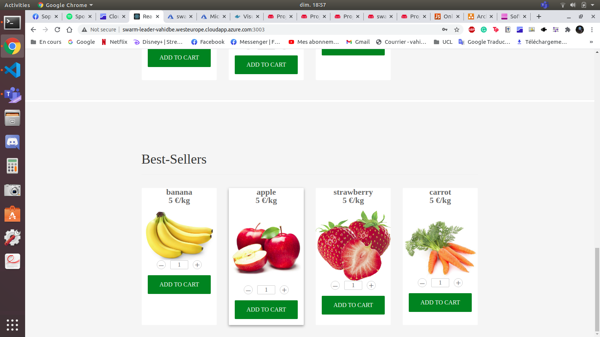
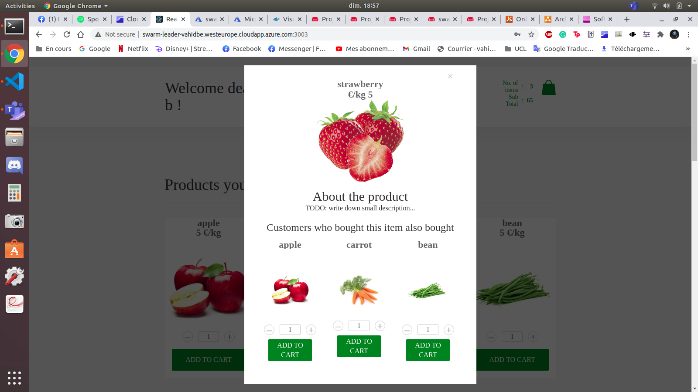
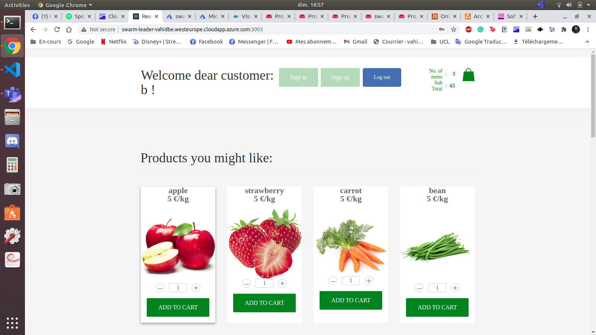

# Front-end: Documentation

## Interfaces
In this section, you will find a description of the content of the different interfaces of the front-end.

### AuthenticationService
This is the interface managing the registering and the login of a user.
It regoups all the calls done by the front-end to the backend for the Authentication microservice (see [USERS.md](../back-end/users/USERS.md) for the complete API).

It contains the following functions:
- `registerUser`: to register a new user
- `loginUser`: to login a user

Feel free to look at the comments in the file [AuthenticationService.jsx](./src/interfaces/AuthenticationService.jsx) to have a more precise description of these functions.

**NOTE:** the way we determine when a user's role is `admin` is a bit different of the original way. Indeed, the `admin` role was given to a user whose username was `admin` but we did not do it like this. The role `admin` is defined by the `role` field of a user. 
Like this, a user is not forced to be called `admin` to be one.  

Here are two ways to register a user with an `admin` role:
1. registering a simple user and then change his role manually in the database,
1. doing a curl request with the role in it :
    ```bash
    curl -X POST --data "username=${name}&role=admin&password=${password}" ${HOST_IP}:3001/user
    ```
    where `${name}` is the name of the user, `${password}` is its password and `${HOST_IP}` represents the IP address of the machine running the Authentication microservice.

These are the only ways to access the admin form. This the case because there is no way to specify the role in the front-end. 
We wanted to add a button or a field to specify the role when registering a user but then we thought that with this, anyone could be an admin, which is not good in a security point of view. So, we then supposed that an admin certainly has access to the different databases or to some microservices informations and so it should be feasible for him to change manually his role.


### CartService
This is the interface managing the cart. It regroups all the calls done by the front-end to the backend for the Cart microservice (see [CART.md](../back-end/cart/CART.md) for the complete API).

It contains the following functions:
- `checkout`: to checkout the cart
- `addToCart`: to add a product to the cart
- `removeFromCart`: to remove a product from the cart 
- `fetchCart`: to retrieve the cart

Feel free to look at the comments in the file [CartService.jsx](./src/interfaces/CartService.jsx) to have a more precise description of these functions.

### CatalogService
This is the interface managing the catalog. It regroups all the calls done by the front-end to the backend for the Catalog microservice (see [CATALOG.md](../back-end/catalog/CATALOG.md) for the complete API).

It contains the following functions:
- `modifyProduct`: to modify a product of the catalog
- `addProduct`: to add a product in the catalog
- `removeProduct`: to remove a product from the catalog
- `fetchProducts`: to retrieve the complete the catalog
- `formatProducts`: to format the retrieved catalog in order to have the ids as Integer and not as String.

Feel free to look at the comments in the file [CatalogService.jsx](./src/interfaces/CatalogService.jsx) to have a more precise description of these functions.

### OrderService
This is the interface managing the orders. It regroups all the calls done by the front-end to the backend for the Orders microservice (see [ORDERS.md](../back-end/orders/ORDERS.md) for the complete API).

It contains the following functions:
- `formatOrders`: to reformat the orders in order to fit the required format used in the checkout component that was given
- `fetchOrders`: to get the orders of the logged user

Feel free to look at the comments in the file [OrderService.jsx](./src/interfaces/OrderService.jsx) to have a more precise description of these functions.

### RecommendationService
This is the interface managing the recommendations. It regroups all the calls done by the front-end to the backend for the Recommendation microservice (see [RECOMMENDATION.md](../back-end/recommendation/RECOMMENDATION.md) for the complete API).

It contains the following functions:
- `fetchRecommendationsForUser`: to get the products recommended for the logged user
- `fetchBestSellers`: to get the best-sellers (the most bought products)
- `fetchRecommendationsForItem`: to get the products recommended for a specific product.

Feel free to look at the comments in the file [RecommendationService.jsx](./src/interfaces/RecommendationService.jsx) to have a more precise description of these functions.


## New Features

This section will summarize the modifications we made in the components provided as well as the new components that we added ourselves.

### Recommendations

The recommendations are now displayed in 3 different ways. 

First of all, both authenticated and non-authenticated users can see the best-sellers products under the catalog as a banner of 4 products that represent the products that were sold the most from the whole catalog from all times. This banner has the same layout as the catalog with a title "Best-sellers" and 4 items that can be added to the cart and opened in the quickview. We used the provided `Products` component to display this banner as well as a line to seperate it from the catalog.



Secondly, both authenticated and non-authenticated users can see item recommendations under each product of the catalog by opening its quickview (by clicking on the image). Under the name, image and other information about the product in its quickview, the users can find a banner of recommended items for the selected items with the title "Customers who bought this item also bought" and a list of 3 products. For this display, we created a new component called `Recommendations`. It is very similar to the products component except for differences in its style.



Finally, only authenticated users can have access to the user-personalised recommendations that are unique to each users, computed on the products that each user added to his cart. Indeed, we compute predictions of the 'most likely to be added to the cart' products by comparing the users similar to the target user and the items that they added to their cart. For more details, please consult [RECOMMENDATION.md](../back-end/recommendation/RECOMMENDATION.md).



The requirements asked for the recommendation to be unique for each user and based on the purchases of other users, and to not recommend items that are already in the cart. Our user-personalised recommendation does conform to these requirements. However, the other types of recommendation do not. We still wanted to add them as a "bonus" to show that we could recommend products with different approaches and as we found it interesting in a shopping website in general.

**Note:** Please keep in mind that the assistants confirmed to us that we could integrate recommendations in other places than below the product quickview, which is why our main recommendation (that conforms with the requirements) is situated below the header as a banner and not below the product in the quickview (where we added secondary recommendations).

### AdminForm

The admin form that was provided did not implement the adding or removing of categories or products. Methods to handle those were added as well as the interface with the back-end. However, we changed the behavior of the ShoppingCartApp in order to redirect the user to the admin form only if its role received during the authentication was the role `admin` (wheras before, we would be redirected to that page if our username was `admin`). 

**Note 1:** Since there is no way to register as an admin through the frontend, the administrators must create their profile through curl or by registering, and then modifying their role in the database manually as said above.

**Note 2:** In our current implementation, a category will only be added to the catalog if it contains at least one product. This means that when the admin adds a category, as long as he does not add a new item in that category, it is only stored locally. When the first product of that category will be added, the call to the back-end will be done and the catalog will be updated.

### Other changes

The rest of the front-end was linked and adapted to our back-end. Indeed, the authentication, catalog, cart and previous purchases are directly plugged to the front-end, which means that the past order, cart and catalog will be fetched by the user when he wants to view the catalog, his cart or his past orders (in the checkout) respectively. It also means that the cart will be updated in the back-end when a user adds or removes items, and the cart will be emptied and the orders updated when the user checks out. Users will fetch recommendations directly from the back-end and be able to login or register using the authentication service. 

In summary, the code of the front-end was adapted to link the back-end completetly and all data is now persistant and not stored locally anymore. 