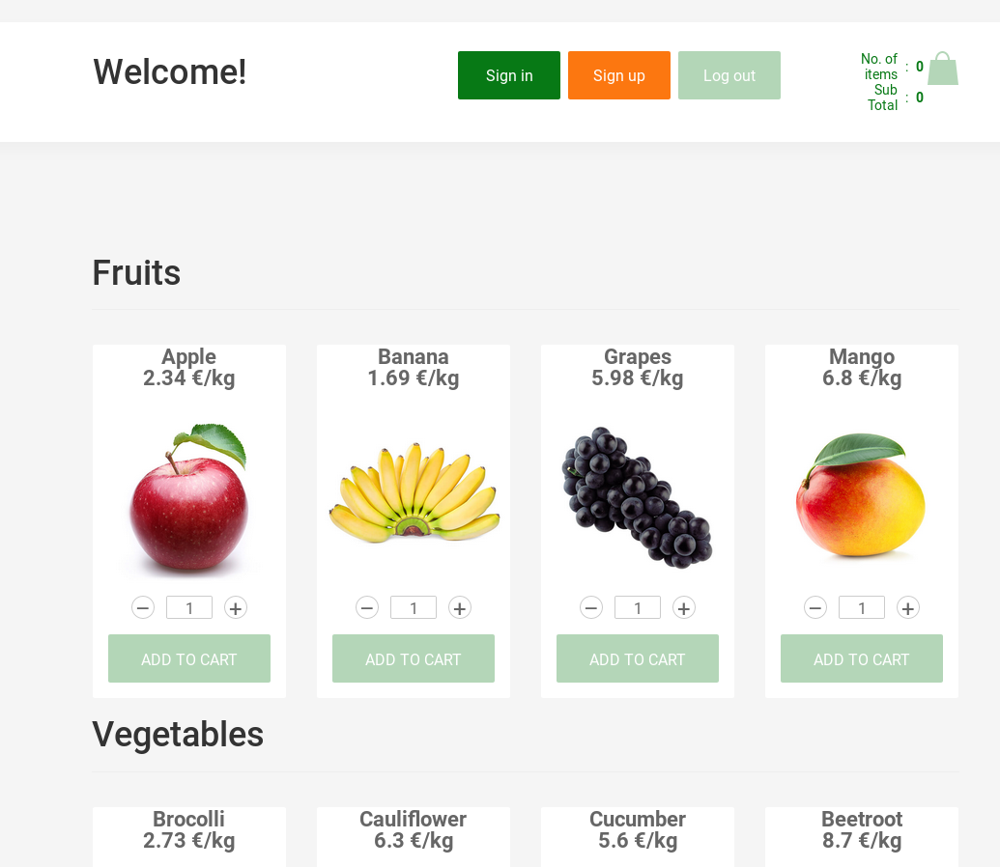

# Introduction
In this text, you will find the documentation of the front-end for a shopping-cart application (SCApp for short).
The structure of the application is kept simple (see image below).



The main page is a catalog of products grouped by categories.
The shopping bag  is the user's cart.

# Purchases in SCApp
Users without an account are **only** able to *consult* the catalog of products while registered users may also *purchase* products.
To create an account, click on the **Sign up** button and provide a username and a password.

The **ADD TO CART** button under every product picture is now enabled.
Users may start the checkout procedure by clicking on the green bag and then on the **PROCEED TO CHECKOUT** button.
Another page appears with the history of purchases.
Whether you confirm or cancel a purchase, you go back to the catalog.

The front-end mimics an authentication service by locally storing users' information.
Note that users authentication information and purchases are not persistent.
If you close your browser, all information is lost.

# Source code
This section provides a brief overview of the code organization.
The front-end is a [React](https://reactjs.org) application, its source code is organized as follows.

```
front-end
├── doc/            << source files to create the documentation
├── package.json    << dependencies and scripts to build/deploy
├── public/         << HTML/CSS content
│   ├── favicon.ico
│   ├── index.html  << main web page
│   └── style.css
└── src/
    ├── interfaces/
    ├── web_page_sections/  << dynamic content
    ├── shopping-cart/      << classes
    ├── App.jsx             << main class
    └── index.js            << entry point of project
```

The front-end is formed of several Javascript classes.
The code of these classes follows the React syntax, a combination of Javascript and XML-like tags (more details in [this link](https://reactjs.org/tutorial/tutorial.html#overview)).

For instance, the class `Header`( source file: `front-end/src/shopping-cart/components/Header.js`) generates an HTML tag with a welcome message in the main page of the front-end.
This is a stub with the constructor of the class `Header`:

``` javascript
<!-- [...] -->
class Header extends Component{
    // constructor
    constructor(props){
        super(props);
        // attributes of class Header
        this.state = {
            showCart: false,
            cart: this.props.cartItems,
            mobileSearch: false,
            // welcome message
            welcomeMsg: 'Welcome'
        }
    <!-- [...] -->
    }
}
```

A simple way to customize the main page is to change the value of the attribute `this.state.welcomeMsg` of class `Header`.

## Detailed documentation
A good starting point, for a better understanding of how this front-end operates, is reading the documentation of the React component `<App />` and continue with `<ShoppingCartApp />`.
These two components orchestrate the main use cases in this front-end.
