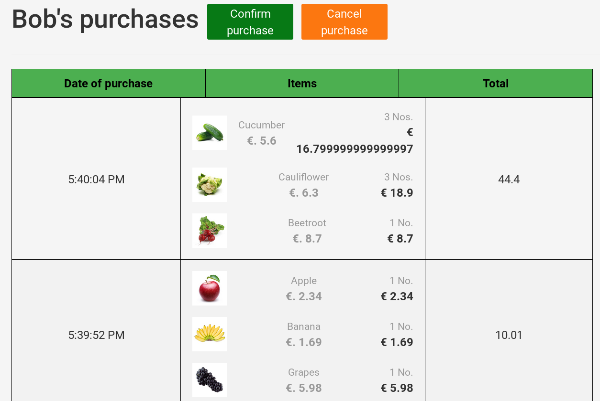

import { Props } from 'docz'
import { ShoppingCartApp } from '../jsx/ShoppingCartApp'

# ShoppingCartApp
This component implements the following use cases of a shopping cart application:

  1. Non authenticated users consult the catalog of products ;
  1. Authenticated users may perform purchases ;
  1. Checkout procedure to confirm purchases ;
  1. Fetch history of previous purchases.

This is a standalone application and data is not persistence, in other words, when users close the web page all information (about users and their purchases) is lost.
The catalog of products only contains few items organized in two categories (fruits and vegetables), see `front-end/src/shopping-cart/components/catalog.js` for more details of the catalog content.

## **Properties**
This section contains a brief description of instance attributes and instance methods in a `ShoppingCartApp` component.

<Props of={ShoppingCartApp} />

## **Events**
Events start when users click on buttons or certain sections on the main web page.
In React, `bind()` is a built-in method to let you define events as instance methods of a component.

- **Note:** All events of every React component, used in this shopping cart application GUI, are defined  in the `constructor()` method of each component.

This section contains a brief description of the main events handle by `<ShoppingCartApp />`.

### **Add item (s) to the user's cart**
*Implementation in method:* `handleAddToCart()`

This event bootstraps when a user click on the `ADD TO CART` button under an item's picture (see image below).

The total number of added items may vary by setting an integer in the text field or using the circled buttons (tagged with `+` or `-`).

### **Remove item (s) from user's cart**
*Implementation in method:* `handleRemoveProduct()`

The following actions trigger this event:

  1. Click on the cart (green bag) ;
  1. Position cursor on the item to remove ;
  1. Click on the red cross, next to subtotal (see image below).

### **Show detailed view of item**
*Triggered by method:* `showItemView()`

This event starts when users click on the picture of an item, a new window pops up (see image below).

This view contains a detailed description of an item, to close this view click on the green button at the top-right corner.
You may also add information about sales (from an external service) on this view, for instance, a list of the top ten sold items during last week.
This view is also a React component named `<QuickView />` (source file: `front-end/src/shopping-cart/components/QuickView.js`).

#### **Replace static content**
To rely on an external service and add an improved description on each item (or information about sales), you may follow these steps:

**1.** Create a new class that will consume the exposed API of your external service ; say this class is named `ImprovedInfo`.
- **Note:** We assume that a method of an `ImprovedInfo` instance fetch information from the external service (for instance, via an HTTP request), say this method is called: `fetchInfo()`.

**2.** Extend the state of `<ShoppingCartApp />` with an instance of `ImprovedInfo`.
- **Good practices in React.** Create such instance in the method `componentWillMount()` of `<ShoppingCartApp />`, this makes sure that your implementation is available when the component shows up.

**3.** Add a new property to `<QuickView />` with a reference to `ImprovedInfo.fetchInfo()`.
- **Note** This let you separate the GUI (component `<QuickView />`) from the implementation of fetching new information

You may follow the previous instructions to add new functionality that relies on an external service.

### **Checkout procedure**
*Triggered by method:* `handleCheckout()`

Before a checkout procedure starts, a user should have at least one item in its cart.
This procedure bootstrap clicking on the cart icon (green bag) and then on the `PROCEED TO CHECKOUT` button (see image below).

A new window pops up showing a table with the user's previous purchases and two buttons (see image below).

Users may confirm or cancel the current purchase clicking on `Confirm purchase` or `Cancel purchase`, respectively.
User's current purchase is shown first on the table of purchases.

A click on any button let a user go back to the main window.
This window is also a React component named `<Checkout />` (source file: `front-end/src/shopping-cart/components/Checkout.js`).

#### **Replace stand-alone version**
To replace the current checkout (stand-alone) procedure with an external back-end service, you also need to revisit the class `PurchaseService` (source file: `front-end/src/interfaces/PurchaseService.js`).
`<Checkout />` is a component that relies on an instance of `PurchaseService`, the API that an external back-end service exposes may be consumed in the implementation of `PurchaseService`.
