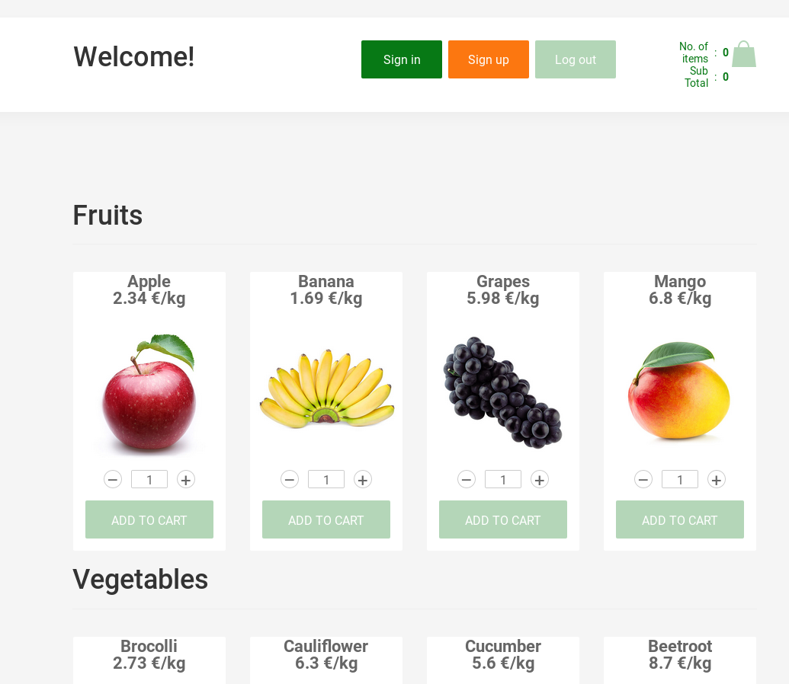
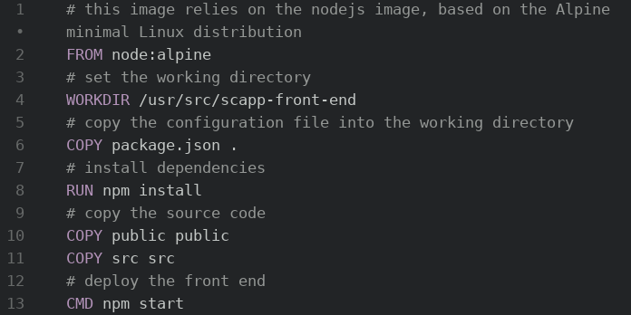

# :books: LINGI2145 Project: Front-end

**LINGI2145 Autumn, 2020** -- *Etienne Rivière, Guillaume Rosinosky and Raziel Carvajal-Gómez*

## Objectives

This tutorial shows you how to:

1. Deploy the latest release of the front-end for the LINGI2145 project;
1. Use the front-end Web interface;
1. Understand the structure of the source code;
1. Build and deploy the front-end with Docker.

:bulb: **Recall.**
We encourage you to follow the tutorial solo.

:bulb: **Recall.**
This tutorial requires you to complete some exercises that are tagged with this icon :pencil2:

## Introduction

The structure of the application is kept simple (see image below).
The main page is a catalog of products grouped by categories.
The shopping bag  is **your cart**.



We detail below how to build and deploy a container with the front-end of the application (*served and running in the client web browser*).
You will need to create and use your container image for development and testing.
However, to get a taste of how the front-end looks like, you can start by trying our exemplary release, which we have made available on Docker Hub ([link here](https://hub.docker.com/repository/docker/lingi2145/scapp-fe-release)).

Run a container of this exemplary front-end image on a docker-enabled VM with:

 ``` bash
 docker run -d -p 3000:80 --name scapp-fe lingi2145/scapp-fe-release:v1.0
 ```

This command downloads the image `scapp-fe-release` from a registry (lingi2145) hosted on DockerHub.
Option `-d` keeps the container running in the background.
Option `--name` sets its name.
Finally, we bind the port the front-end uses (port `80`) to port 3000 of the host machine.
The container internally uses port 80 always, but feel free to use another port for mapping on the host (e.g. if 80 is already in use).

To open the welcome page, type down the IP address of the WM in your web browser.

## Purchases in SCApp

Users without an account are **only** able to *consult* the catalog of products while registered users may also *purchase* products.
To create an account, click on the **Sign up** button and provide a username and a password.

The **ADD TO CART** button under every product picture is now enabled.
Users may start the checkout procedure by clicking on the green bag and then on the **PROCEED TO CHECKOUT** button.
Another page appears with the history of purchases.
Whether you confirm or cancel a purchase, you go back to the catalog.

The front-end mimics an authentication service by locally storing users' information.
Note that users authentication information and purchases are not persistent.
If you close your browser, all information is lost.

## Source code

Since you will make minor changes to the front-end in the first part of the project, this section provides a brief overview of the code organization.

The front-end is a [React](https://reactjs.org) application.
Its source code is in the folder `../src/front-end`.
Below, you will find a brief description of its content.

``` text
front-end
├── doc/            << documentation of main components
├── package.json    << dependencies and instructions to build/deploy
├── public/         << HTML/CSS content
│   ├── favicon.ico
│   ├── index.html  << main web page
│   └── style.css
└── src/
    ├── interfaces/ << classes with calls to REST services
    ├── web_page_sections/  << dynamic content
    ├── shopping-cart/      << classes
    ├── App.jsx             << main class
    └── index.js            << entry point of project
```

The front-end is formed of several Javascript classes.
The code of these classes follows the React syntax, a combination of Javascript and XML-like tags (more details in [this link](https://reactjs.org/tutorial/tutorial.html#overview)).
For instance, the file [`Header.js`](../src/front-end/src/shopping-cart/components/Header.js) generates an HTML tag with a welcome message in the main page of the front-end.
This is a stub with the constructor of the class `Header`:

``` javascript
<!-- [...] -->
class Header extends Component{
    // constructor
    constructor(props){
        super(props);
        // attributes of class Header
        this.state = {
            showCart: false,
            cart: this.props.cartItems,
            mobileSearch: false,
            // welcome message
            welcomeMsg: 'Welcome'
        }
    <!-- [...] -->
    }
}
```

A simple way to customize the main page is to change the value of the attribute `this.state.welcomeMsg` in the class `Header`.

:pencil2: **Exercise.** Change the welcome message of the front end. [This link](../src/front-end/src/shopping-cart/components/Header.js#L17) points to the line of code to alter in the file `Header.js`.

To confirm that the welcome message is now different, the next section explains how to build and run the front-end in your own container.

:bulb: **Hint**.
We encourage you to read the instructions in the file [../front-end/doc/README.md](../front-end/doc/README.md) to deploy a Docker container that allows you to consult the documentation of the front-end source files.

## Build and deploy

`npm` is a package manager for Javascript.
Some of the tasks you may perform with `npm` are: installation of dependencies, creation of releases or unit testing.
React applications are maintained with `npm`.
The tool is already included in the `nodejs` base Docker image.

Now that we have made a change to the front-end code, we need to rebuild the docker image.
This image shall contain the source code itself, and all dependencies, libraries, etc. it needs.

:pencil: **Note.**
The list of dependencies is in the JSON file `package.json`.

The following Dockerfile lets you build an image of the front-end.



:pencil: **Exercises.**
To create a container with the new version of your front-end, complete these tasks:

1. Create a `Dockerfile` with the previous content in the directory `../src/front-end`;
1. Build an image of your new front-end with the name `scapp-frontend` and run a container of this image;

- :warning: The port `3000` of your laptop was used to run the release version of the front-end, use a different port number.

1. In a new tab of your web browser, show the main page of the front-end;
1. Confirm that there is a welcome message (your modification) that differs from the release version.

:bulb: **Recall.**
Whenever you alter the source code, you have to re-build the Docker image.

## Final comments

:checkered_flag: **That's it.**
You have now an overview of the front-end.
Continue with the authentication micro-service tutorial ([link here](02_ProjectSetup_AuthenticationService.md)).
