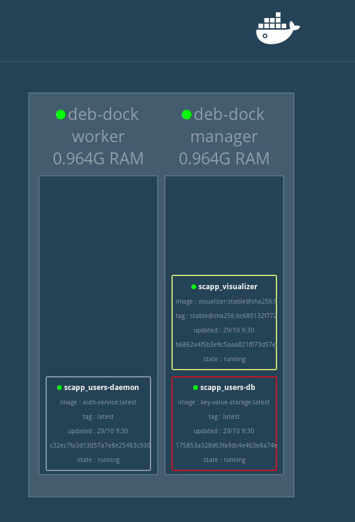

# :books: Elastic scaling of the authentication service

**LINGI2145 Autumn, 2020** -- *Etienne Rivière, Guillaume Rosinosky and Raziel Carvajal-Gómez*

## Introduction

In this tutorial you will learn how to use Docker Swarm, the native cluster manager of Docker, to elastically scale the authentication service.
We show how to implement a basic policy of scalability based on CPU usage.

### Objectives

This tutorial shows how to:

1. Create a cluster of 2 virtual machines;
1. Instantiate a swarm over this cluster of VMs;
1. Deploy and monitor a set of services;
1. Implement a simple elastic scaling policy;
1. Deploy a scalable authentication service under this policy.

:bulb: **Recall.**
We encourage you to follow the tutorial solo.

:bulb: **Recall.**
This tutorial requires you to complete some exercises that are tagged with this icon :pencil2:

### Prerequisites

If you **have not completed** the NoSQL database tutorial and do not have an authentication service that stores users' information in a CouchDB database ([link here](03_NoSQL_databases.md#books-nosql-databases)), do it before going through this tutorial.

## Set up a cluster of nodes

We start by setting up an infrastructure formed of 2 VMs running docker.
One VM will be the *manager* and the second one will be a *worker*.

:pencil2: **Exercise.**
Create a clone of the original VM you have been using, and install Docker engine on it in order to deploy Docker containers.
Be sure that you have 2 running VMs with Docker.
You can read again the instructions to create VM clones on [this link](../../tutorials/01_VirtualMachines#books-lab-session-1-virtual-machines).

### Create a Docker swarm

A *swarm* is a cluster of nodes (VMs or physical machines) that host Docker containers.
Nodes within a swarm are linked by a network, i. e., nodes in a swarm can communicate with each other.
These nodes are either *managers* or *workers*.
There must be at least one node with the role of manager.

Open a terminal in the manager VM to instantiate a swarm:

``` bash
docker swarm init --advertise-addr IP_OF_VM_LEADER
```

- :warning: **Do not forget** to replace `IP_OF_VM_LEADER` with the IP address of the manager VM

You should get an output similar to the following one:

```bash
Swarm initialized: current node (3u3ewnwinnsi4novo17c4cw0o) is now a manager.

To add a worker to this swarm, run the following command:

    docker swarm join --token SWMTKN-1-4t62zblvqtz5ebfkoqm75s44tg4vei75m7ebcq3z9dpv9ld7om-3p0hni7m3jm59g0etq6lw4zna 192.168.56.102:2377

To add a manager to this swarm, run 'docker swarm join-token manager' and follow the instructions.
```

At this point, you have a swarm with a single node, the swarm manager.

:pencil2: **Exercise.**
The command to create a swarm also shows a command to add new nodes to the swarm.
Use this command in the second VM to add a new node to the swarm.

The manager monitors every aspect of the swarm.
For example, to list the nodes in a swarm you can now use the command `docker node ls` from the manager VM.

We are now ready to deploy containers in our swarm of 2 nodes.

### Store images in Docker Hub

Using a cluster of nodes will require you to make your Docker images available from any of these nodes. This avoids the inconvenience, for example, of having to build images within a node that has recently joined a cluster.

Docker Hub is a public registry that allows you to push/pull Docker images to/from the Cloud and link these images to userspace.

:warning: This is simply a storage of Docker images and you are responsible to maintain every image (build and make them available).

We use Docker Hub to store images, follow these steps.

1. Create a login in Docker Hub by clicking on this link: [www.hub.docker.com](https://hub.docker.com/);
1. You will get a Docker ID, which is your userspace to keep images;
1. Prepare your VM, the one you chose as swarm leader, as follows:

- Write down the command `docker login`;
- Type your Docker ID and the password of your Docker Hub account.

You are now ready to store images in Docker Hub as follows.

:warning: **Replace** `${DOCKER_ID}` with the ID linked to your Docker Hub account, in the instructions shown below.

1. We start by storing the CouchDB image `kv-storage-system` you build in the previous tutorial ([here more details](03_NoSQL_databases.md#couchdb-in-a-nutshell)). First, we need to append your Docker ID with the following command.

    ```bash
    docker tag kv-storage-system ${DOCKER_ID}/kv-storage-system
    ```

1. Finally, you store the image in Docker Hub as follows.

    ```bash
    docker push ${DOCKER_ID}/kv-storage-system
    ```

That's it, your image is now public and might be pulled from any host running docker. You can confirm that there is a new image in your user space in Docker Hub.

:pencil2: **Exercise.** Store the image of the authentication service in your Docker Hub space.

### Deploy services with Docker Swarm

Until now you have kept deploying services:

1. performing changes to the source code of your application;
1. building Docker images;
1. running and linking containers.

A more programmatic way to deal with your deployment is to create a Docker Compose descriptor of your application using a YAML file (more details about this format [here](https://en.wikipedia.org/wiki/YAML)).
The following file is a descriptor of our shopping cart application, which contains (until now) only the authentication service (file location: [../src/scapp.yml](../src/scapp.yml)):

```yaml
version: "3"
services:     # list all services for your application
  # database of users
  users-db:
    # image name
    image: ${DOCKER_ID}/kv-storage-system:latest
    ports: ["3001:5984"]
    deploy:
      # deploy only one instance of this service
      replicas: 1
      restart_policy:
        # restart if something went wrong
        condition: on-failure
    networks: [ "scapp-net" ]
  # server that listens HTTP requests
  users-daemon:
    image: ${DOCKER_ID}/scapp-auth:latest
    # link both services (same effect of option --link in docker run)
    depends_on: [ "users-db" ]
    # expose port number 3000 of host running this service
    ports: [ "3000:80" ]
    deploy:
      replicas: 1
      restart_policy:
        condition: on-failure
    networks: [ "scapp-net" ]
  # Docker GUI for swarms
  visualizer:
    image: dockersamples/visualizer:stable
    ports: [ "80:8080" ]
    volumes:
      - "/var/run/docker.sock:/var/run/docker.sock"
    deploy:
      # locate this service in the swarm manager
      placement:
        constraints:
          - node.role == manager
    networks: [ "scapp-net" ]
networks:
  scapp-net:
    external: true
```

:warning: **Replace** `${DOCKER_ID}` with the ID linked to your Docker Hub account, in the YAML file.

This descriptor indicates that the authentication service requires a database (service `users-db`) and a NodeJS server (`users-daemon`) that exposes its REST API.

Recall, an instance of `users-daemon` listens internally on port `80`.
Having the tag `ports: [ "3000:80" ]` means that a machine hosting `users-daemon` exposes port `3000` and forwards incoming traffic to port `80` that the service listens to.
The tag `depends_on: [ "users-db" ]` makes the database reachable from the NodeJS server.

A new service (`visualizer`) was added to fetch information from the swarm manager.
This is a GUI (Graphical User Interface) that Docker provides to have a global view of swarms.

- :warning: Even if this new service is in the descriptor of the shopping cart application, notice that `visualizer` does not interact with any other service.

First of all, we create a network of containers as follows.

```bash
docker network create --driver overlay --attachable scapp-net
```

- :bulb: The option `--driver` and `--attachable` allows to add containers in the network on-demand -- you will see an example of it later on in this tutorial.

We have all we need to deploy our application with the following command:

```bash
docker stack deploy -c scapp.yml scapp
```

Get a view of your swarm by visiting the IP address of the leader VM in your Web browser.
You should get a page similar to this one:



You can now confirm that your swarm contains two nodes and that there is one running container per service listed in the YAML file.

### Docker stack

With `docker stack` you can control the group of services listed in a YAML project descriptor.
To list the running services of our stack `scapp`, use `docker stack services scapp`.
You will get an output like this:

```bash
ID                  NAME                 MODE                REPLICAS            IMAGE                             PORTS
61jcl63y5zx7        scapp_users-daemon   replicated          1/1                 scapp-auth:latest                 *:3000->80/tcp
s5so8x8w0cvc        scapp_visualizer     replicated          1/1                 dockersamples/visualizer:stable   *:80->8080/tcp
wp5l4z81srj8        scapp_users-db       replicated          1/1                 key-value-storage:latest
```

You may notice that each service name is prefixed with `scapp_` to identify the stack this service belongs to.
Feel free to look at the documentation with `docker stack -h`.

#### Overlay Network

As you might recall, we use the option `--overlay` in the creation of a network to communicate the containers in our application. This option allows to forward requests, addressed to any node in the swarm, to any service in the stack.

:pencil2: **Exercise.** You can confirm so by creating two different users. Create one user using the IP address of one VM in the swarm and create another user with the IP address of the second VM.

:bulb: **Recall.** That the authentication service listens on the port `3000`.

#### Update stacks on the fly

We can update the number of running services on each stack without interrupting its execution.
For instance, to double the replicas of the NodeJS server type the following command: `docker service scale scapp_users-daemon=2`.

:pencil2: **Exercise.**
Confirm that there is an additional NodeJS server using the visualizer.

## Elastically scaling the authentication service

Managers let you monitor every node in the swarm and also every stack of services.
We take advantage of this centralized observer to monitor the CPU usage of every replica running the NodeJS server (that supports our authentication service).
With these metrics, we can implement a simple elastic scaling policy: *When the average CPU usage of all nodes in the swarm reaches a certain threshold, we add more replicas.*

:warning: **Prerequisites**. Make sure that you can create an SSH connection from the manager VM to the worker VM.

:pencil2: **Exercise.**
To do so, in a console **on the manager VM** create an SSH keypair and add the public key in the file `~/.ssh/authorized_keys` on **the worker VM**.
Test the connection with this command: `ssh user@<WORKER_VM_IP_ADDRESS>` - you should not be asked to type a password.

- :bulb: **Recall** that you already learned how to do so in the VMs tutorial ([link here](../../tutorials/01_VirtualMachines/README.md#connecting-to-your-vms-using-ssh))
- :warning: Create this SSH key pair with an empty passphrase

### Implementation of scalability policy

The script [../src/scalability/apply-policy-of-scalability.sh](../src/scalability/apply-policy-of-scalability.sh) implements the policy of scalability.
You have to open a new terminal in **the manager VM** to run this script. In order to execute it, you should have to modify the execution rights of this script with the following command: `chmod +x ./apply-policy-of-scalability.sh`.

- :bulb: Look carefully at the content of this script. This implementation makes use of the native commands in docker and no other orchestration feature is needed to make it work.

### :pencil2: Exercise: Test the policy of scalability

To see our elastic scaling policy in action, we will inject traffic to the authentication service using [artillery](https://artillery.io/).
You can deploy the provided container to perform such traffic injection and then, launch the script that implements the scalability policy.
Complete the following task:

- Apply the policy of scalability.
    1. Open a new terminal on the manager VM;
    1. Go to the directory `../src/scalability/` and type down the following command:

        ```bash
        ./apply-policy-of-scalability.sh scapp users-daemon
        ```

        :bulb: **Note.** This command instructs to monitor the service `users-daemon` of the stack `scapp` and triples the number of replicas (of users-daemon) when the average CPU usage of the current replicas reaches 90% of CPU usage.

- Deploy the container that injects traffic.
    1. Open a new terminal on the manager VM;
    1. Go the directory `../src/scalability/artillery` and build an image with the provided Dockerfile;
    1. **Run** a container out of such image and **link** this container with the network of the stack `scapp`, you can do so with this command: `docker run -d --name load-test --network scapp-net <REPLACE_WITH_NAME_OF_IMAGE>`.

Looking at the docker visualizer you will see new replicas of `users-daemon` in your swarm, as shown here:


#### Delete everything

Remove the stack with:

```bash
docker stack rm scapp
```

You can also remove a node from the swarm with:

```bash
docker swarm leave --force
```

## Final comments

:checkered_flag: **That's it, you made it.**
You have now a microservice that automatically scales up when needed.
