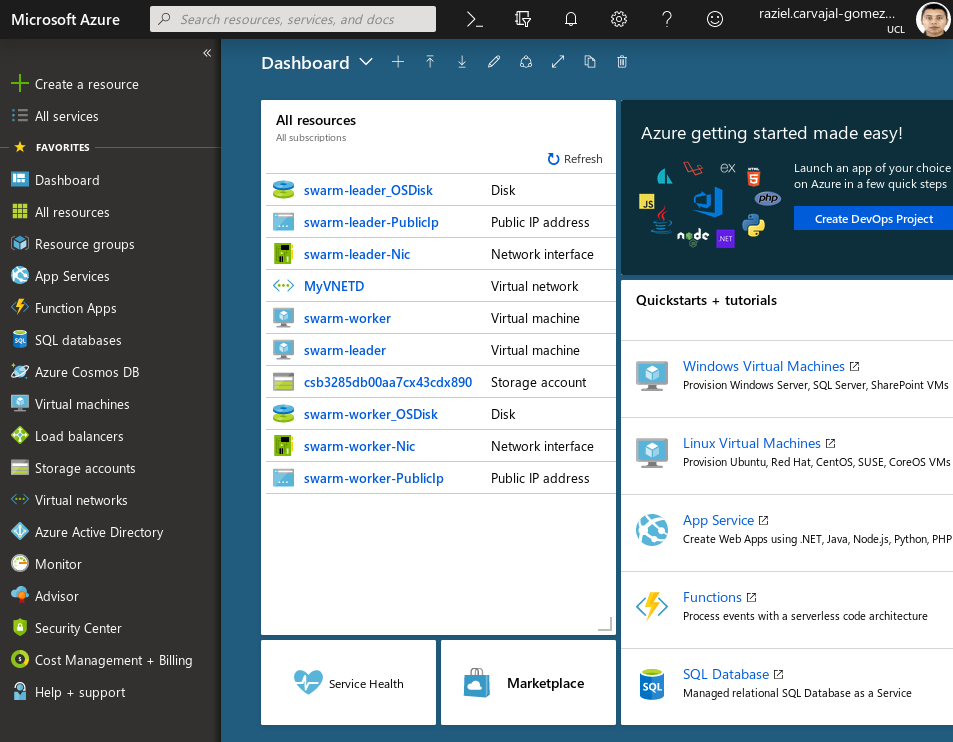
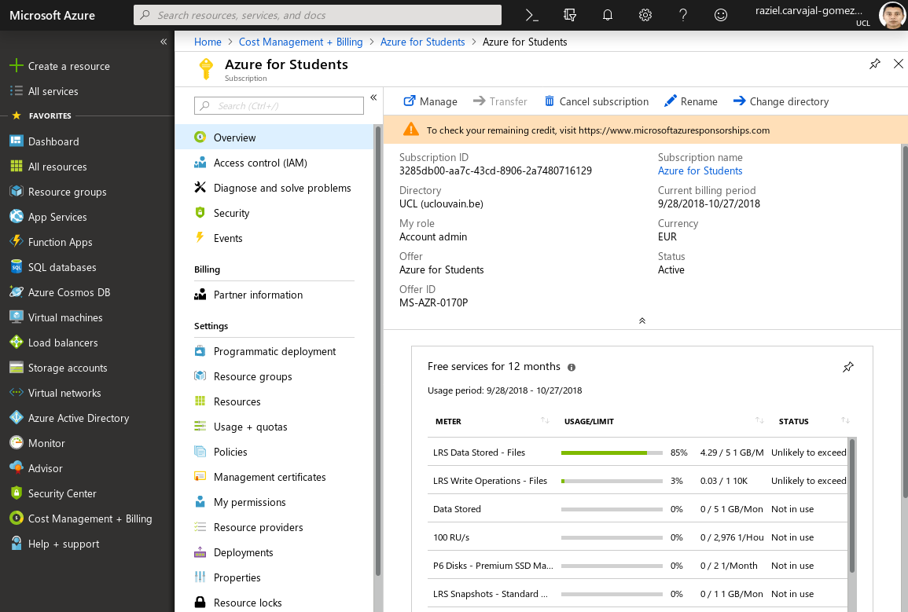
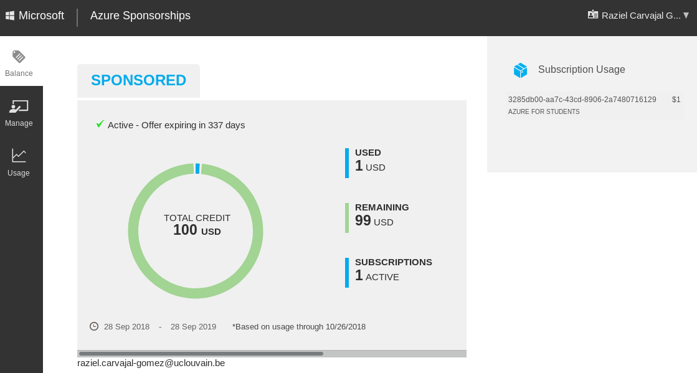
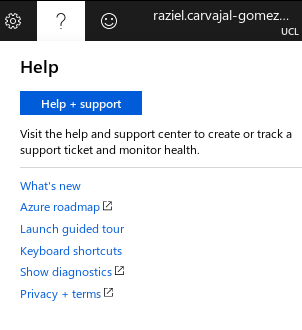
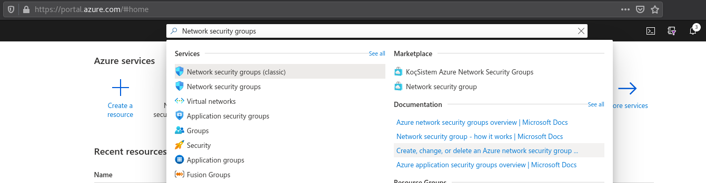
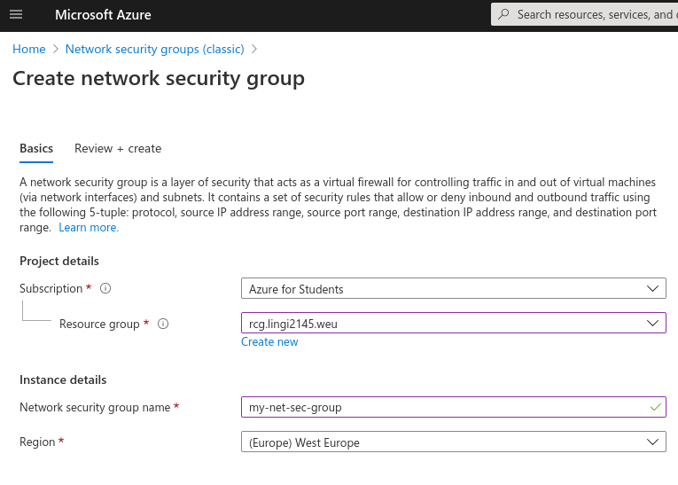
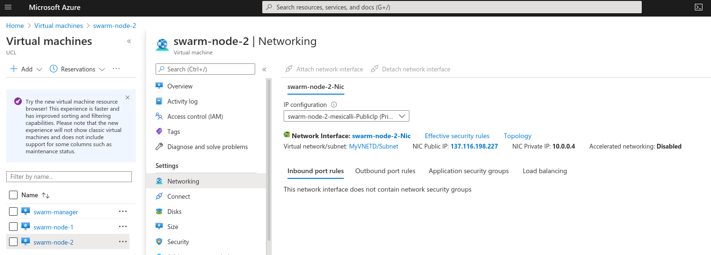
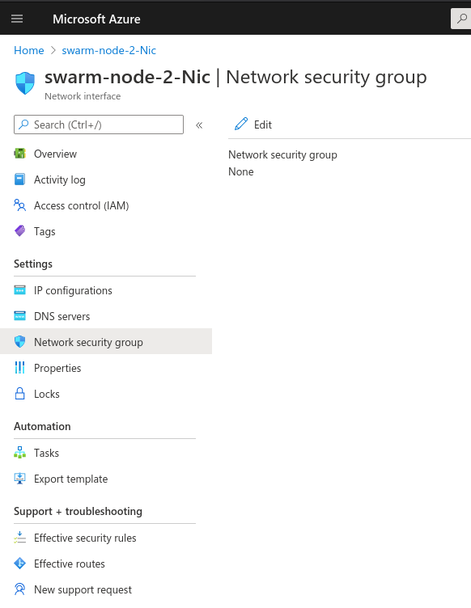
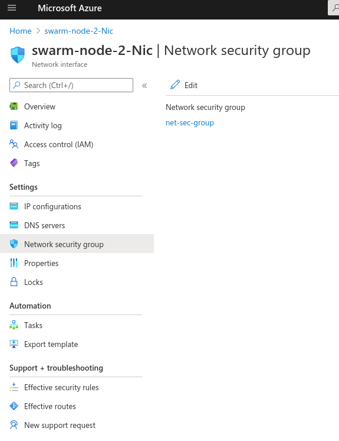
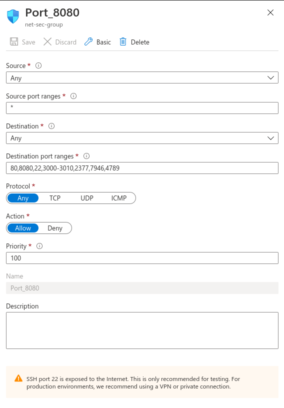

# :books: Microsoft Azure

**LINGI2145 Autumn, 2020** -- *Etienne Rivière, Guillaume Rosinosky and Raziel Carvajal-Gómez*

Azure is Microsoft's Infrastructure as a Service (IaaS) and Platform as a Service (PaaS) cloud offering.
It offers all features you can expect from a major cloud provider, e.g., serverless processes, virtual networks, managed databases, and virtual machines.
In this tutorial, we will use Azure as an IaaS provider to deploy a cluster of two virtual machines, supporting Docker, to run our authentication service for the LINGI2145 project.
This setup will be similar to the one you have set up on your laptop in the previous tutorials.

:pencil: **Note.** This tutorial was written using the following guide as the main reference: [Get started guide for Azure developers](https://docs.microsoft.com/en-us/azure/guides/developer/azure-developer-guide).

## Azure for Students

By validating your affiliation at UCLouvain you will be able to take advantage of a **one-time student offer of 100 USD worth of credits of Azure resources.**
You may use these credits within one year since the creation of an Azure account.
**The process does not require providing a credit card number.**
If you are asked for one, it means you are instead creating a regular account, and the LINGI2145 will not be held responsible for any cost.

:warning: **You have only one shot to activate your account.**
Read carefully all instructions below to activate the offer and **ask for help** to the assistants if you hesitate on how to proceed.

To activate your account, follow [this link](https://azure.microsoft.com/en-us/free/students/), click on the button **Activate now** and complete these instructions:

1. Login using a personal Microsoft account (Hotmail or Outlook);

    :warning: If you do not have a Microsoft account create one using the option *Create account*

1. Fill the form **Azure for Students**;
    1. Chose *School email address* as the verification method
    1. Type down your UCLouvain e-mail address (*name.surname@student.uclouvain.be*)
    1. Click on *Verify and claim your offer*

1. Open your UCLouvain mailbox and click on the provided link in the e-mail you will eventually receive;
1. Filling the form **Azure for Students signup**
    1. Chose the country code of your mobile number
    1. Type down your mobile number
    1. Click on *Text me*
    1. Type down the verification code that you will eventually receive by SMS
    1. Click on *Verify code*
    1. Agree to the terms and conditions and finish with the offer claim

Once you complete the subscription procedure, you should see the following dashboard:



## Azure Portal Overview

Azure Portal is a website used to manage resources in Azure, consult documentation/tutorials, and get information about your account.
We will use this interface to fetch information about resources and manage your account.
For instance, to consult the list the resources you used, click on ***Cost Management + Billing > Azure for Students***, to get the following screen:



On the center of the previous screenshot, you can see several details about your account (status, subscription ID, etc).
On the bottom, you see a summary of the usage of Azure resources.
To consult your remaining credits, click on [https://www.microsoftazuresponsorships.com](https://www.microsoftazuresponsorships.com) and select the option ***Check Your Balance***.
The following chart will be displayed:



Azure Portal provides several other features; have a look around in the GUI to explore what is offered.
You can also launch a guided tour by clicking on ***Help > Launch guided tour*** as shown in the following screenshot:



### Understanding my account and resource groups

This section gives an overview of several terms that are frequently used in the Azure official documentation.

**Azure account.**
Authentication information of a Microsoft account.

**Azure subscription.**
A subscription associates a set of resources with an Azure account.
More than one subscription may be linked per account.
By default, the owner of an account is the administrator of its Azure resources as well.
Alternatively, it is possible to create groups of users and define roles (more information in [this link](https://docs.microsoft.com/en-us/azure/role-based-access-control/overview)), allowing them to manage their associated resources.

The cost of using any resource is charged to at least one subscription.

:pencil: **Note.** You probably noticed already that your UCLouvain account grants you one subscription, the *Azure offer for students*.

**Resource groups.**
Every resource in Azure, such as Virtual Machines (VMs), Network Interface Cards (NICs), or virtual networks, are linked to resource groups.

You may see such groups as trees, where the root is the name of a group.

```text
lingi2145-fr
├── public-ip
├── sql-database
├── virtual-machine
│   ├── network-interface-card
│   └── standard-hdd
└── virtual-network
```

In the previous example, `lingi2145-fr` is a resource group that is hosted in a data center in France.
It is a good practice to include the location of a group in its name (the -fr suffix).
Naturally, there are dependencies between the elements of a group.
For instance, the public IP address is within the range of valid addresses in the virtual network.

:pencil: **Note.** Azure has several data centers in different regions of the world (more details about regions in [this link](https://azure.microsoft.com/en-us/global-infrastructure/regions/)). Later in this tutorial, you will deploy resources and it is advisable to use a data center close to your location, to decrease access latencies.

With all these in mind, you are now ready to use the command-line tool that Azure provides: [Azure CLI](https://docs.microsoft.com/en-us/cli/azure/?view=azure-cli-latest).

### Azure CLI

The Azure CLI is a command-line interface to manage your resources.
For instance, you may create a new Ubuntu VM with this command:

```bash
az vm create --name MyGNULinuxVM --resource-group MyGroupFr --image UbuntuLTS
```

The previous example links the new VM to the group `MyGroupFr`.
Keep in mind that every resource in Azure needs to be linked to some groups.

:pencil: **Note.** As pointed out in previous tutorials, when you hesitate in how to use a command, you should always look at the documentation by using the option `-h`. For instance:

```bash
az vm create -h
```

You may use the shorthand version of the options `-n` and `-g` instead of the options `--name` and `--resource-group`, respectively.
For the rest of the tutorial, we will make use of the following commands:

```bash
# Manages resource groups
az group [Command]
# Instantiates pre-configured resources from a template file
az group deployment [Command]
```

Templates in Azure are JSON (JavaScript Object Notation) files that allow you to set up resources.
For instance, the following description snippet sets up some options for a virtual machine:

```json
{
  "location": "eastus",
  "privateIpAddress": "10.0.0.4",
  "publicIpAddress": "52.174.34.95",
  "resourceGroup": "MyGroupFr",
  "ubuntuOSVersion": {
    "type": "string",
    "defaultValue": "14.04.4-LTS",
    "metadata": {
      "description": "The Ubuntu version for deploying Docker containers."
    }
  }
}
```

**Don't panic!** We will provide you with a template that configures a VM with Docker. More details about Azure templates can be found at [this link](https://docs.microsoft.com/en-us/azure/azure-resource-manager/resource-group-overview#template-deployment).

**Setting up the Azure CLI.** There are two ways to start working with the Azure CLI:

- Install Azure CLI directly on your system (recommended).
- Leverage the built-in command-line available within the Azure Portal: [Cloud Shell](https://docs.microsoft.com/en-us/azure/cloud-shell/features) (icon **>_** at the top of the GUI).

:warning: We strongly recommend you to install the Azure CLI following [this link](https://docs.microsoft.com/en-us/cli/azure/install-azure-cli?view=azure-cli-latest).

:pencil: **Note.** Once the Azure CLI has been installed, type down `az login` to start a new session (this action is not required within the built-in Azure Cloud Shell).

## Deploy applications with Azure templates

We are now ready to deploy an infrastructure consisting of two VMs, set up a Docker Swarm, and deploy the authentication service.
We provide you with a JSON description file that configures a VM with Docker.
You will reproduce the scalable authentication service from the [previous tutorial](04_Scalability.md#Objectives)).

:warning: This last part demands you to complete several tasks, based on what you have learned in previous tutorials.
These tasks are tagged with the symbol :pencil2:

## Setting up virtual infrastructure

First, create a resource group in a data center closer to Belgium (for instance, in the Netherlands) using a variant of the following command:

```bash
az group create --name lingi2145.weu --location westeurope
```

You can check the successful creation of your new resource group using:

```bash
az group list
```

In the following, we will link our Azure resources to this group.

To start, we will set up a network with two VMs using an interactive procedure via the command `az group deployment create [...]`.
Each VM will have a public IP and a DNS name.
The complete configuration file is available [here](https://tinyurl.com/azure-template). Proceed as follows:

1. Create an instance of an Ubuntu VM with Docker with this command:

    ```bash
    az group deployment create --resource-group lingi2145.weu --template-uri https://tinyurl.com/azure-template
    ```

1. You are asked to provide a user name and password for the administrator's account.

    :warning: [The rules](https://www.debian.org/doc/manuals/debian-reference/ch04.en.html#_good_password) to create a valid password, for a GNU/Linux system, apply in this step.

1. You are also asked to provide a DSN name.

    :warning: A valid DNS name is a string of up to 63 alphanumeric characters. Such a string follows this regular expression `^[a-z][a-z0-9-]{1,61}[a-z0-9]$`

1. You are asked to provide the user name of your Github account

    :bulb: This avoids having 2 VMs with the same DNS name

    :warning: Please, use lower case and respect this regular expression `^[a-z][a-z0-9-]{1,61}[a-z0-9]$`

1. :clock3: **Wait** until the creation of the VM.

1. The DNS name of your new VM is set to:

    ```bash
    ${PROVIDED_DNS_NAME}-${PROVIDED_GITHUB_ACCOUNT}.westeurope.cloudapp.azure.com
    ```

    :bulb: **Example.**
    For instance, we get `swarm-leader-mexicalli.eastus.cloudapp.azure.com` as DNS name when `PROVIDED_DNS_NAME=swarm-leader` and `PROVIDED_GITHUB_ACCOUNT=mexicalli`

1. Log in to your new VM via SSH as follows:

    ```bash
    ssh ${USER_NAME}@${PROVIDED_DNS_NAME}-${PROVIDED_GITHUB_ACCOUNT}.westeurope.cloudapp.azure.com
    ```

    :bulb: Write down the administrator's password you set before.

1. Verify that Docker is available at your new VM

1. In your web browser go to Azure Portal and check what resources are in usage in your dashboard.

:pencil2: **Exercise.** Create an SSH key pair to access your VM without writing down the administrator's authentication information.

**That's it**, you have your first VM running in Azure!

### Ingress port rules

By default, VMs in Azure allow inbound traffic only for SSH connections (on port 22). To deploy services in Docker, we need to allow inbound traffic for Docker swarm and also, for the API of each service you want to expose to the world. You can do so following these steps:

1. In the Azure Home page, write down *Network security groups* in the search bar and chose this option (as shown below);

    

1. Click on the *Add* button, chose the name of your resource group and give a name for this resource (as shown below). Then, click on the *Review + create* button;

    

1. Select the view *Virtual machines* in the Azure Home page, click on the name of your VM, select *Networking* in the list of settings and click on the name of the **Network Interface** (as shown below);

    

1. You will be directed to the configuration page of the Network Interface of your VM (as shown below). Chose *Network security group* in the list of settings and click the Edit button (blue pencil icon).

    

1. Add a new group by clicking on the word *None*, chose the name of the group and click on the *Save* button. Once the change took place, you should see an image similar to the one shown below;

    

1. Go back to the networking settings of your VM, as explained before in step No 3, click on the blue button *Add inbound port rule* and write down the following list of ports `80,8080,22,3000-3010,2377,7946,4789` in the text field: *Destination port ranges*. Confirm the changes by clicking on the *Save* button (as shown below).

    

That's it, you are all set to deploy Docker services.

:bulb: **Inbound ports for your microservices.** Use the range of ports `3000-3010` to expose your services.

:bulb: **Inbound ports for the Docker Visualizer and SSH.** Naturally, we allow inbound traffic for SSH and the Visualizer in ports `22` and `80`, respectively.

:bulb: **Inbound ports for Docker Swarm**. The ports `2377`, `7946` and `4789` are reserved to manage nodes in Docker swarm.

## :pencil2: Exercise: Create a Swarm in Azure

You are now asked to create a Docker swarm of two VMs in Azure to reproduce the [tutorial about elastic scaling](04_Scalability.md#Deploy-your-cluster-with-Docker-swarm).

With the provided template you can create up to 10 VMs with unique DNS names (i. e., any pair of VMs cannot have the same DNS name).
Proceed as follows:

1. Create another VM in Azure as [explained before](#setting-up-virtual-infrastructure).Optionally, you may use the same SSH key-pair to log into the second machine.

1. You have to choose one VM as a swarm leader and another VM as a worker;
1. Initialize a swarm;

    :warning: This command must be performed in the leader.

    :warning: Use the public IP address of the swarm leader, **and not the DNS identifier**, reserved for this VM in the argument for the option `--advertise-address`.

1. Add the second machine to your swarm

    :warning: This command must be performed in the worker.

    :warning: Include the option `--advertise-address`, **in the command `docker swarm join`**, and use the public IP address of **the second VM** as an argument for this option.

1. Confirm that the second VM has the new inbound rule, you configure in the previous section;

1. You can monitor all nodes from the swarm leader via `docker node`.

- list all nodes with `docker node ls`

**Notice** that at this point you already have a Docker swarm of two VMs running in Azure. Let's now deploy the authentication service.

1. Copy the configuration file of our authentication service (located at `project/src/scapp.yml`) with:

    ```bash
    scp PATH_TO_YML_FILE/scapp.yml ${USER_NAME_OF_SWARM_MANAGER}@${SWARM_MANAGER_WITH_FULL_AZURE_DSN_NAME}:~/
    ```

1. Login via SSH to the swarm leader and deploy the stack `scapp`;
1. Monitor services with:

    ```bash
    docker service ls
    ```

1. With the visualizer, you can now confirm that your swarm contains two nodes and all containers of the authentication service are running.

    :bulb: **Notice** that you can see the visualizer from your web browser using the full DSN name of Azure that you set to the swarm leader.

:checkered_flag: **Congratulations**, you have now your first service running in Azure.

:bulb: **Turn-off your VMs**. Do not forget to turn-off your VMs to avoid unnecessarily charges.
