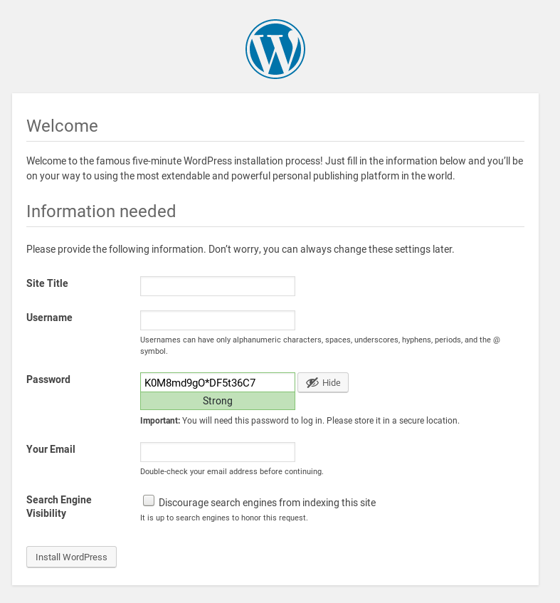
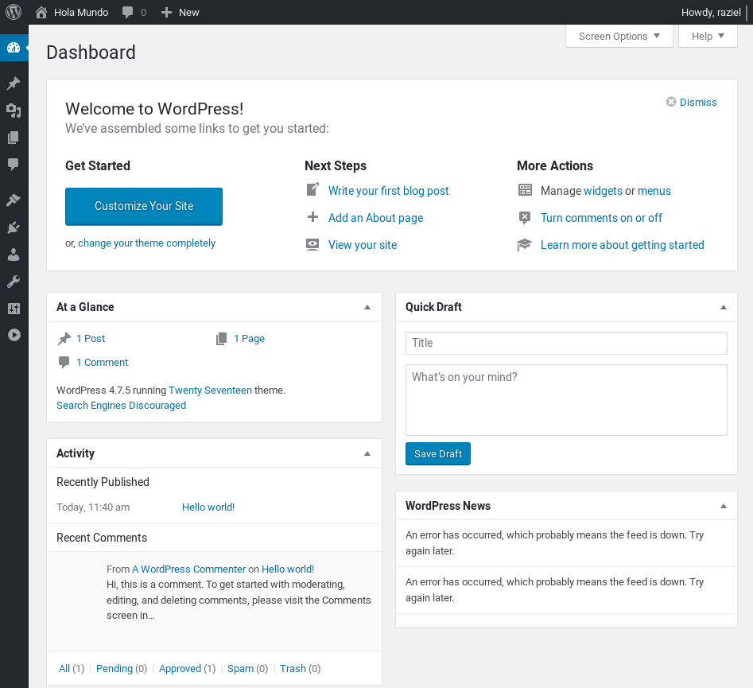

# :books: Deploy a Web application

**LINGI2145 Autumn, 2020** -- *Etienne Rivière, Guillaume Rosinosky and Raziel Carvajal-Gómez*

:warning:
This tutorial assumes that you have created a virtual infrastructure (with VirtualBox) of 2 Virtual Machines (VMs). If this is not the case, complete the tutorial about virtual machines ([link here](README.md)).

## Objective

In this tutorial we show you how to make use of a virtual infrastructure with 2 VMs to deploy [Wordpress](https://wordpress.com/), a popular Web hosting service.
Particularly, this tutorial shows you how to configure a first guest OS (Operating System) to manage the Data Base (DB) Wordpress requires and another guest OS will only contain a Web server.

:warning:
This tutorial requires you to complete some exercises, which are tagged with this icon: :pencil2:.

## Prerequisites

<!--
# NOTE the creation of a second clone makes more sense here
Use the IP address with the subnet of our virtual network (192.168.33 in this example).

:pencil2: **Exercise.**
Check that you can also login with SSH into the newly created VM.

:pencil2: **Exercise.**
Check that you have the file `debian_with_ssh.ovf`. Destroy the origin `myvm` Virtual Machine.
Create a second VM using the `import` command. Change its hostname to a name different of the first VM.

:pencil2: **Exercise.**
Check that the two VMs can communicate with each other, using the *ping* utility from inside the VMs. -->

You have to create one guest OS to keep the DB of Wordpress and another to run the Web server.
An easy way to identify the role of each guest OS is to change its hostname.

:bulb:
We have already shown you how to change the hostname of a guest OS (see how to do it in [this link](README.md#update-the-network-configuration-of-a-vms-os)).

This tutorial assumes that your guest VMs Operating Systems are identified with the hostnames `web-db` and `web-service`, respectively.
We also assume that you have an open SSH connection to both OSs in 2 different terminals on your laptop.
You'll have to create these two VM. Be cautious to check their IP addresses. In the case of collision (same IP address for multiple VM) following the clone operation, reboot all your VM to have a unique IP address assigned to each VM.

## Setting up the database host

:warning: **Note.**
Be sure to perform every step on this section in the guest OS `web-db`.

Wordpress relies on a relational DB to store a variety of information, such as user accounts, rules to control access to Web content, etc. We use [MariaDB](https://mariadb.org/) as MySQL server and configure the DB of Wordpress.

:pencil2: **Exercise.**
Install the package `mariadb-server` on `web-db`.

### Secure your MySQL server

MariaDB comes with a script to override the default, and rather insecure, configuration the freshly installed MySQL server. You may run such a script with: `sudo mysql_secure_installation`.

You are asked to answer some questions about the new configuration. We recommend you to answer as follows:

1. *Question:* `Change the root password? [Y/n]`. *Answer:* `Y` ;

  :warning: You need to type twice your new password.

1. *Question:* `Remove anonymous users? [Y/n]`. *Answer:* `Y` ;

1. *Question:* `Diasallow root login remotely? [Y/n]`. *Answer:* `n` ;

1. *Question:* `Remove test database and access to it?`. *Answer:* `n` ;

1. *Question:* `Reload privilege tables now? [Y/n]`. *Answer:* `Y`.

:bulb: **Recall.**
This configuration improves the security of the MySQL *daemon* and you can use it in production mode.

### Allow remote access

MariaDB does not allow remote access by default, but we need to access its databases from the other VM OS `web-service`. Allow remote access to DBs in `web-db` as follows:

1. Open the configuration file of MariaDB with: `sudo nano /etc/mysql/mariadb.cnf`;

1. Append the content below; this configuration instructs the deamon of MariaDB to use *127.0.0.1* (localhost) as the address to expose (and not a fixed IP).

```conf
[mysqld]
skip-networking=0
skip-bind-address
```

1. Apply the changes with `sudo systemctl restart mysql`.

### Create the Wordpress DB

We now create a new database for Wordpress. Open a new file with `nano wp.sql` and add the following content:

```sql
CREATE DATABASE wordpress;

GRANT SELECT, INSERT, UPDATE, DELETE, CREATE, DROP, ALTER
  ON wordpress.*
  TO wordpress@'%'
  IDENTIFIED BY 'wordpress';

FLUSH PRIVILEGES;
```

With the previous instructions, we indicate MariaDB to create an empty database (called *wordpress*) and grant access to only one user (also called *wordpress*) that initiates a connection from a remote host.

The authentication information of such a user is as follows: `username/password=wordpress/wordpress`.

Apply the previous configuration with: `cat wp.sql | sudo mysql`

Check that the *wordpress* database has been created by list all available databases with: `sudo mysql -e "show databases"`

## Setting up the web host

We are now ready to start the configuration of a Web server. Wordpress requires the following packets: `wordpress`, `curl` and `apache2`.

:warning: **Note.**
Be sure to perform every step on this section in the guest OS `web-service`.

:pencil2: **Exercise.**
Install the required packages for Wordpress.

We will create a new Web site for Wordpress that will be hosted in [Apache](https://httpd.apache.org/), a popular HTTP server. Follow these steps:

1. Create the file `/etc/apache2/sites-available/wp.conf` as `root` using the editor `nano`;

1. Add the content shown below;

    ```xml
    <VirtualHost *:80>

      ServerName 127.0.0.1

      DocumentRoot /usr/share/wordpress
      Alias /wp-content /var/lib/wordpress/wp-content

      <Directory /usr/share/wordpress>
        Options FollowSymLinks
        AllowOverride Limit Options FileInfo
        DirectoryIndex index.php
        Require all granted
      </Directory>

      <Directory /var/lib/wordpress/wp-content>
        Options FollowSymLinks
        Require all granted
      </Directory>

      ErrorLog ${APACHE_LOG_DIR}/error.log
      CustomLog ${APACHE_LOG_DIR}/access.log combined

    </VirtualHost>
    ```

1. Disable the default configuration of Apache: `sudo a2dissite 000-default`

1. Tell Apache to use our new website: `sudo a2ensite wp`

1. Finally, restart the daemon of Apache to apply the previous changes: `sudo systemctl reload apache2`

With the previous instructions, the Apache daemon uses our new Website by showing the welcome page of Wordpress (located in `/usr/share/wordpress`).

As a final step, we indicate Wordpress the authentication information of the Wordpress DB as well as the remote host that contains such DB. Continue with the following steps:

1. Create the file `/etc/wordpress/config-IP_ADDR_OF_WEB-SERVICE.php` as `root` using the editor `nano`;

    :warning: **Note.**
    Do not forget to replace *IP_ADDR_OF_WEB-SERVICE* with the IP address of the guest OS `web-service` in the title of the PHP file.

1. And add the content shown below.

    ```php
    <?php
      define('DB_NAME',       'wordpress');
      define('DB_USER',       'wordpress');
      define('DB_PASSWORD',   'wordpress');
      define('DB_HOST',       'IP_ADDRESS_OF_WEB-DB');
      define('WP_CONTENT_DIR','/var/lib/wordpress/wp-content');
    ?>
    ```

    :warning: **Note.**
    Do not forget to replace *IP_ADDRESS_OF_WEB-DB* with the IP address of the guest OS `web-db` in the previous content.

That's it, you can now start using Wordpress to design your new web site :sunglasses:.

## Start using Wordpress

In your web browser just type down the IP address of the guest OS `web-service`, you will see the Welcome page of Wordpress.

 

 Follow the instructions of the welcome page and once you authenticate, the Dashboard window of Wordpress pops up.

 

Find more details about how to customize your web content in the official site ([link here](https://www.wordpress.com)).

## Final comments

:checkered_flag: **Congrats, you made it !**.
In this tutorial you have learnt how to deploy a Web hosting service in a virtual infrastructure of two VMs.
Do not forget to stop your VMs to avoid decreasing the performance of your system.
