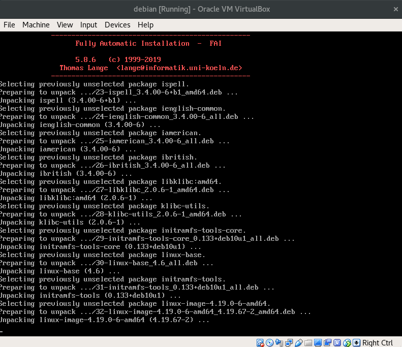
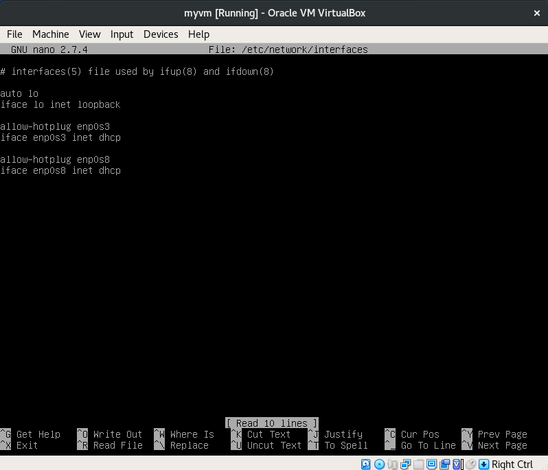

# :books: Lab Session 1: Virtual Machines

**LINGI2145 Autumn, 2020** -- *Etienne Rivière, Guillaume Rosinosky and Raziel Carvajal-Gómez*

## Objectives

The goal of this tutorial is to show you how to set up a virtualized infrastructure similar to a remote cloud IaaS, on your own laptop.
This virtualized infrastructure will feature several virtual machines (VMs) linked by a virtual network.
The virtual machine image you will build during this session will be reused for all tutorials and for the project.
As an additional exercise, you will deploy a Web hosting service as an example of an application running over multiple VMs.

At the end of this tutorial, you will know how to:

- create and deploy Virtual Machines (VMs);
- create a network to let VMs communicate with each other;
- install and deploy a multi-tier web application using several VMs.

:warning:
We encourage you to **follow the tutorial solo**.

:warning:
This tutorial requires you to complete some exercises, which are tagged with this icon: :pencil2:

:warning:
**Prerequisites.** Before you continue, click on [THIS LINK](Prerequisites.md) to install the required software.

## Setup a virtual infrastructure with VirtualBox

In this section, you will learn how to configure and create a new Virtual Machine (VM), how to clone a VM, and how to deploy multiple VMs on the same host (your laptop). VMs host a minimalistic GNU/Linux Operating System (OS) with a reduced number of software packages.

:bulb:
We also want to limit the number of resources used by each VM (hard drive space, CPU, memory).

VirtualBox comes with a Command Line Interface (CLI) accessible from a terminal on your laptop using the command `VBoxManage`. Learning the CLI of VirtualBox right from the start is important to enabling automatization later. Feel free to find further details on the official documentation ([click here](https://www.virtualbox.org/manual/ch08.html)).

:warning:
From now on, you will be asked to write down different commands in a terminal of your laptop. For this tutorial the working directory is the folder `tutorials/01_VirtualMachines`, open a terminal and be sure to be in this directory.

### Create and set up your first VM

We start by creating a new (empty) VM and registering it with the name: **myvm**.

```bash
# creates an empty VM
VBoxManage createvm --name myvm --ostype "Debian_64" --register
```

We also require to create a hard disk drive with a capacity of ~12GB, to install a GNU/Linux distribution, as well as its controllers.
These three commands do, respectively: Create a virtual hard drive, create a virtual disk controller for the VM, and finally attach the virtual hard drive to the virtual controller.

```bash
# creates a virtual Hard Drive (HD)
VBoxManage createhd --filename myhdd.vdi --size 12000
# creates a driver for the HD
VBoxManage storagectl myvm --name "SATA Controller" --add sata --controller IntelAHCI
# links HD and its controller to the VM
VBoxManage storageattach myvm --storagectl "SATA Controller" --port 0 --device 0 --type hdd --medium myhdd.vdi
```

We will install a fresh operating system in our VM from an ISO image (a virtual DVD-ROM).
Click on [THIS LINK](https://drive.google.com/file/d/1WAFj_BcXdgBSU244JxArxqOhPMKgqgtj/view?usp=sharing) to download the ISO image and save it in the local folder `01_VirtualMachines`.

We will load the ISO image to a virtual DVD drive.
We, therefore, need a CD/DVD drive attached to our VM:

```bash
# creates a CD/DVD dirver
VBoxManage storagectl myvm --name "IDE Controller" --add ide
# links driver and ISO image
VBoxManage storageattach myvm --storagectl "IDE Controller" --port 0 --device 0 --type dvddrive --medium mini.iso
```

As for a physical machine, our virtual machine has a boot order: It will look onto its storage devices in a certain order and boot the first one that contains an operating system (OS).
There is currently no OS on our virtual disk, but the virtual DVD (Debian installer) is bootable.
We can therefore use the order disk first, then DVD:

```bash
# change booting order: first, use the HD and then using the virtual CD/DVD
VBoxManage modifyvm myvm --boot1 disk --boot2 dvd
```

Finally, we set the amount of RAM for our VM to 1GB.

```bash
# VM with one core and ~1G of RAM
VBoxManage modifyvm myvm --memory 1024
```

Our VM is now ready, start it with the following command.

```bash
VBoxManage startvm myvm
```

### GNU/Linux installation

VirtualBox pops up a console (see image below).
The installation is **fully automated**, the VM boots on the virtual DVD and starts the Debian GNU/Linux installer.
Wait until the installation finishes and the VM reboots.



Now that the virtual hard drive contains a bootable sector, the VM starts the freshly installed Debian OS.
You are asked to login in your new OS with the following authentication information, **login: user** and **password: user**.

:warning: **Important.**
When you click on the VirtualBox console, the cursor of the mouse in your laptop is disabled. The keys *Ctrl+Alt+Delete* **disable the virtual console and enable the host OS (your laptop).**

:pencil2:
**Exercise.** Complete the following tasks.

- Add the user name `user` to the list of administrators ; this will let us install packages via the `sudo` command. Do as follows:

  - Type the command `su -c "usermod -aG sudo user"` and use the string `user` as password;
  - Press *Ctrl+D* to log out;
  - Login again using the authentication information of `user`.

- With the `date` command, you can notice that the guest OS have a time zone other than CET (Central European Time). Change the time zone as follows.

  ```bash
  sudo timedatectl set-timezone Europe/Brussels
  ```

- Confirm that the time zone has changed.

- In case **you do not use a QWERTY keyboard**, change the configuration of the keyboard in the new guest OS as follows. Use VirtualBox soft keyboard (in Input menu) if you do not manage to find the keys in the mean time.

  ```bash
  sudo dpkg-reconfigure keyboard-configuration
  ```

  followed by a reboot of the VM as shown below.

  ```bash
  # option -r implies reboot the OS
  sudo shutdown -r now
  ```

By default, VirtualBox associates your VM with a virtual Network Interface Controller (NIC) providing Internet access through NAT ([Network Address Translation](https://en.wikipedia.org/wiki/Network_address_translation)). You can confirm the internet is reachable using the command `ping google.com` and also, by installing new software.

#### Extend your guest OS with new packages

In the following sections, we will use `wget`, a program to retrieve content via a bunch of Internet protocols (e.g. HTTP or FTPS). Install `wget` as follows (type `user` as password when needed):

```bash
# updates the list of Debian repositories
sudo apt-get update
# install wget
sudo apt-get install -y wget
```

##### VirtualBox additional packages for guest OSs

VBoxManage creates and configures virtual resources (e. g. network interfaces, drivers, etc) and also, let you run programs at guest OSs from your laptop (host OS). **This is very useful**, for instance, to get the IP address of the guest OS.

To control guest OSs from your laptop through VBoxManage, we need to install the package Guest Additions (more details on [this link](https://www.virtualbox.org/manual/ch04.html)) of VirtualBox following these steps:

1. In a terminal of the guest OS, install the required packages;

    ```bash
    sudo apt-get install -y build-essential module-assistant
    ```

1. Configure your system to build a kernel-based module for `VBoxManage`;

    ```bash
    sudo m-a prepare
    ```

    :warning: In this step, confirm the changes typing *Y* and complete with *Enter*.
1. We are now ready to install Guest Additions. Fetch the ISO image of guest additions with `wget`;

    ```bash
    wget https://download.virtualbox.org/virtualbox/VIRTUAL_BOX_VERSION/VBoxGuestAdditions_VIRTUAL_BOX_VERSION.iso
    ```

    :warning: In the previous link, **you should replace** `VIRTUAL_BOX_VERSION` with the version of VirtualBox. From a terminal in your laptop, retrieve your version with `VBoxManage --version`. The output you get looks as follows: **6.1.14**r140239 (in this example, **6.1.14** is the correct version number).

    :bulb: **Confirm that you fetch the ISO file** listing all items in the current directory with the command `ls -lat`

1. Create a new directory to mount the content of the ISO image;

    ```bash
    mkdir iso_content
    ```

1. Copy the content of ISO image;

    ```bash
    sudo mount -o loop VBoxGuestAdditions_VIRTUAL_BOX_VERSION.iso iso_content
    ```

    :bulb: **Confirm that the directory `iso_content` is not empty** listing all items on it with the command `ls -lat iso_content`

1. Install Guest Additions.

    ```bash
    sudo sh iso_content/VBoxLinuxAdditions.run
    ```

**That's it**, you can now confirm that it is possible to **execute commands within the guest OS from the host OS (your laptop)** via the command `VBoxManage guestcontrol` as the following example shows:

```bash
VBoxManage guestcontrol myvm --username user --password user run --exe /bin/ls -- ls -lat /home/user/iso_content
```

:pencil2: **Question?**
Could you explain what is the aim of the previous command?

To conclude this section, power-off gracefully the guest OS from your laptop as follows.

```bash
VBoxManage controlvm myvm acpipowerbutton
```

#### VirtualBox console

VirtualBox pops up a virtual screen when we start our VM.
This is convenient for a guest OS with a graphical interface, e.g. for running Windows in a VM on a Mac.
However, **this is not how VMs are accessed in the Cloud**: Only remote access is available using a secure remote connection with SSH.
We will set up this access method later, but first, we need to create our first virtual Network.

### Network configuration

Our goal is to have a local infrastructure with multiple VMs.
The network support of VirtualBox only allows connections from the guest VM to the Internet, as is arguably sufficient for most users.
In our case, we need to setup a virtual network that will allow several guest VMs to communicate between them in addition to communicating to remote services.
This virtual network will feature a DHCP server to dynamically assign IP addresses to VM guests OS.

In the following two sections, we will:

1. Enable a Host-Only network interface on your host OS and set it up in your VM;
1. Configure the VM to automatically request an IP address for that interface using DHCP.

#### Setup a virtual Host-Only network with a DHCP server

VirtualBox provides ready-made network interfaces.
You can list the details of pre-configured host-only interfaces using `VBoxManage list hostonlyifs`.

:warning:
If the list of interfaces is empty, create one with the command `VBoxManage hostonlyif create` and check the list again.

You should obtain an output similar to this one:

```text
Name:            vboxnet0
GUID:            786f6276-656e-4074-8000-0a0027000000
DHCP:            Disabled
IPAddress:       192.168.33.1
NetworkMask:     255.255.255.0
IPV6Address:
IPV6NetworkMaskPrefixLength: 0
HardwareAddress: 0a:00:27:00:00:00
MediumType:      Ethernet
Status:          Down
VBoxNetworkName: HostInterfaceNetworking-vboxnet0
```

You can confirm this by listing the network interfaces in your host OS.
On a Linux host, you can use the command `ip address` (`ipconfig` under Windows, `ifconfig` on a Mac/BSD) and observe that your host has an IP address assigned to *HOSTONLY_IF_NAME*; as it is shown below depending on your host OS.

Under Linux:

```text
vboxnet0: <NO-CARRIER,BROADCAST,MULTICAST,UP> mtu 1500 qdisc pfifo_fast state DOWN group default qlen 1000
    link/ether 0a:00:27:00:00:00 brd ff:ff:ff:ff:ff:ff
    inet 192.168.33.1/24 brd 192.168.33.255 scope global vboxnet0
       valid_lft forever preferred_lft forever
```

Under Windows:

```text
Ethernet adapter VirtualBox Host-Only Network #9:

   Connection-specific DNS Suffix  . :
   Link-local IPv6 Address . . . . . : fe80::49b3:5:11c7:487e%27
   IPv4 Address. . . . . . . . . . . : 192.168.33.1
   Subnet Mask . . . . . . . . . . . : 255.255.255.0
   Default Gateway . . . . . . . . . :
```

We will use the above network interface *vboxnetX* (*VirtualBox Host-Only Ethernet Adapter #X*) as our virtual network.

:warning:
**Windows users.** Names of network interfaces are a bit more articulated (e.g.: *VirtualBox Host-Only Ethernet Adapter #123*).
In the commands below, make sure to surround the interface name with double-quote to deal with spaces.

The assignment of IP addresses to the OS guest VM should rely on a DHCP server.
The following command will create such a server, attached to *HOSTONLY_IF_NAME* (`vboxnet0` in the above example).
We also configure the DHCP server with a pool of 100 IP addresses:

```bash
VBoxManage dhcpserver add --ifname HOSTONLY_IF_NAME --ip HOSTONLY_IF_SUBNET.1 --netmask 255.255.255.0 --lowerip HOSTONLY_IF_SUBNET.100 --upperip HOSTONLY_IF_SUBNET.199
```

:warning:
Replace HOSTONLY_IF_NAME with the name of the Host-Only interface and HOSTONLY_IF_SUBNET with its correct subnet (e.g. `192.168.33.` in the example). It is also possible that the DHCP server already exists.

You can now enable the DHCP service with:

```bash
VBoxManage dhcpserver modify --ifname HOSTONLY_IF_NAME --enable
```

Finally, we also add a *second* network card to our VM and virtually link it to *HOSTONLY_IF_NAME*.

```bash
VBoxManage modifyvm myvm --nic2 hostonly --hostonlyadapter2 HOSTONLY_IF_NAME
```

:pencil2: **Exercise.** Confirm that there is a second NIC, with the name of the host-only network interface, via the command `VBoxManage showvminfo REPLACE_WITH_VM_NAME`. **Notice** that `VBoxManage showvminfo` output several details about the VM.

**That's it**, you configured your first virtual network and your laptop is also part of it.

#### Update the network configuration of a VM's OS

Now that we have created a Host-Only network interface and set-up a DHCP server for it, we need to update our VM's OS network configuration accordingly. Do as follows:

1. Start again the VM from host: `VBoxManage startvm myvm`;
1. Login using the `user` login;
1. List network interfaces with the command `ip address`. You get an output similar to this one:

    ```bash
    user@unassigned-hostname:~$ ip address
    2: enp0s3: <BROADCAST,MULTICAST,UP,LOWER_UP> mtu 1500 qdisc pfifo_fast state UP group default qlen 1000
        link/ether 08:00:27:3d:a9:c2 brd ff:ff:ff:ff:ff:ff
        inet 10.0.2.15/24 brd 10.0.2.255 scope global dynamic enp0s3
           valid_lft 86316sec preferred_lft 86316sec
        inet6 fe80::a00:27ff:fe3d:a9c2/64 scope link
           valid_lft forever preferred_lft forever
    3: enp0s8: <BROADCAST,MULTICAST,UP,LOWER_UP> mtu 1500 qdisc pfifo_fast state DOWN group default qlen 1000
    ```

1. Note down the name of the new **disabled network interface** ( `enp0s8` in this case); notice that there is no IP address assigned to this interface.

We will use the text editor `nano` to create a descriptor of our second network interface, as follows.

```bash
# creates a configuration file for network interfaces
sudo nano /etc/network/interfaces
```

:pencil2: **Exercise.**
The picture below shows the `nano` editor and **the content you should type down** for the second network interface.


:bulb:
**Recall.** In `nano` you press *Ctrl+O* to save the changes, confirm them and leave the editor with *Ctrl+X*.

The previous file will instruct the OS to fetch an IP for our new network interface using DHCP. Finally, we enable the network interface as follows.

1. Restart the network interface with `sudo /sbin/ifup enp0s8`;
1. List again the network interfaces via `ip address`.

Verify that your guest OS has a new IP address that belongs to the `enp0s8` interface, and **write it down**.

### Access the guest OS from your laptop

Our final step in setting up a remote and secure connection using SSH.
We will first connect using some password-based authentication, and then set up the automatic login using some RSA keypair.

From a terminal **on the host system** (laptop), run `ssh user@GUEST_OS_IP_ADDRESS`.

As before, the authentication information is **login: user** and **password: user**.
Keep this connection open as we will need it soon.

#### Login using an RSA key pair

We will set up a [RSA key pair](https://en.wikipedia.org/wiki/Public-key_cryptography) on the host OS and use it for automated authentication in the guest VM OS.

Follow the instructions [HERE](RSAKeyPair.md) to configure your host and guest VM with RSA authentication.

:pencil2: **Exercise.**
Once you complete the creation of an RSA key pair, **turn off the guest OS.**

### Launching multiple VMs

Now that we have set up one VM with a minimalistic guest OS, we want to be able to launch new instances or clones of this VM.

#### Prepare for cloning

The cloning operation creates a copy of the disk in the guest OS. However, some identifiers such as the machine identifier ([machine-id](https://wiki.debian.org/MachineId)) need to be unique for each VM on our virtual network.

:pencil2: **Exercise.**
To create clones of your VM, complete the following task.

1. Login to the guest OS if not done already;
1. Create a reference to the machine ID as follows:

    ```bash
    sudo truncate -s 0 /etc/machine-id
    sudo rm /var/lib/dbus/machine-id
    sudo ln -s /etc/machine-id /var/lib/dbus/machine-id
    ```

1. Shut down the VM.

Another important step (described in the next part) is to define a unique `hostname` for each VM.

#### Cloning VMs

We will first create a VM image, that we can re-import later. Start by **shutting down the VM `myvm`**, if not done already.

:warning:
Confirm that any VM is not running with `VBoxManage list runningvms`; you should see an empty output.

You can create an image (in the OVF VM image format, which includes the virtual hard drive and all of the VM configuration), using:

```bash
VBoxManage export myvm -o debian_with_ssh.ovf
```

:warning:
Wait until the command `VBoxManage export [...]` finishes.

Once the VM exists in the system, we can create clones of a VM using the following command:

```bash
VBoxManage clonevm myvm --name myvm-clone --register
```

**We will never launch again the VM `myvm`.**

#### Start a VM without using the VirtualBox console

**From now on**, we will never run the VM with an attached virtual screen. Instead, we will always run it in the background.
From your laptop, you may start a VM in headless mode as follows.

```bash
VBoxManage startvm REPLACE_WITH_VM_NAME --type headless
```

:warning:
While launching a VM in headless mode, you should wait for a few seconds to allow the VM to boot, and you can retry logging in with ssh from a terminal on the host.

:pencil2: **Exercise.**
Start the new VM `myvm-clone` (in headless mode) and wait for the OS to finish booting up.

#### Log on the VM clone

To connect to the VM, we need to find its IP address.
However, we cannot log in directly using the virtual screen (and we do not want to do this either).

The following command allows obtaining the IP address that has been assigned to the new VM by the DHCP server:

```bash
VBoxManage guestcontrol myvm-clone --username user --password user run --exe /bin/ip -- ip address show
```

To identify every guest OS in a unique way, we need to change its *hostname*. To do so, follow these steps (in this example, we use `myvm-clone` as hostname):

1. Log in to the VM `myvm-clone` via SSH;
1. Set a new hostname with `sudo hostnamectl set-hostname myvm-clone`;
1. Update the file `/etc/hosts` as root with the editor `nano` to replace the previous hostname. This is an example of how the file `/etc/hosts` may look like:

    ```text
    127.0.0.1   myvm-clone
    ::1         myvm-clone ip6-localhost ip6-loopback
    ff02::1 ip6-allnodes
    ff02::2 ip6-allrouters
    ```

    :warning:
    You just have to replace the word `localhost` with `myvm-clone` in only two places (as shown in the previous output).

1. Press *C+d* to log out and log in again using the user/user login name and password. Notice that your new hostname is `myvm-clone`.

From now on, **every time you create a new VM clone you MUST choose a different hostname** for each VM. Choose for instance `myvm1` for the next VM you will create.

## Final comments

:checkered_flag: **Congrats, you complete your first tutorial.**
You learned how to deployed a virtual infrastructure with some VMs and set up a connection (via SSH) to the guest OSs from your laptop. You may want to make use of this infrastructure for deploying an application. As an additional exercise, [this tutorial](DeployWebApp.md) shows you how to deploy a Web hosting service on your virtual infrastructure.

### Summary of useful commands in VirtualBox

| Function | Command |
|----------|---------|
| Start VM (with window) | `VBoxManage startvm somevm` |
| Start VM (without window) | `VBoxManage startvm somevm --type headless` |
| Clone VM | `VBoxManage clonevm somevm --name somevm-clone --register` |
| Check VM IP address | `VBoxManage guestcontrol myvm-clone --username user --password user run --exe /bin/ip -- ip address show` |
| Graceful shutdown VM | `VBoxManage controlvm somevm acpipowerbutton` |
| Hard shutdown VM | `VBoxManage controlvm somevm poweroff` |

### :no_entry_sign: Troubleshooting

Sometimes, the DHCP server does not assign an IP address to every guest OS. This is caused by a bug in the built-in VirtualBox DHCP.

To prevent this issue, you might change the DHCP lease to a higher value in the corresponding configuration file (access to it with `sudo nano /etc/dhcp/dhclient.conf`), and adding the following line: `send-dhcp-lease-time 36000` for a 10 hours lease.

In case your guest OS lost its IP address anyways, follow these steps:

- If your host computer hibernates, it will break down the DHCP server. **YOU NEED TO REBOOT YOUR COMPUTER AFTER EACH HIBERNATION, or disable the hibernation feature.**
- If there have been issues with the DHCP server (or no address is set anymore), you should reboot the VM or manually renew the DHCP lease with the command `sudo dhclient`. No IP address given after this command is launched means VirtualBox DHCP server is blocked. In this case reboot your host computer, as said before.
- In the case of collision (same IP address for multiple VM) following the clone operation, reboot all your VM to have a unique IP address assigned to each VM.
