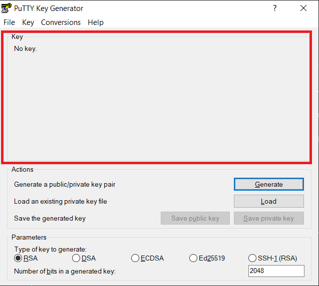
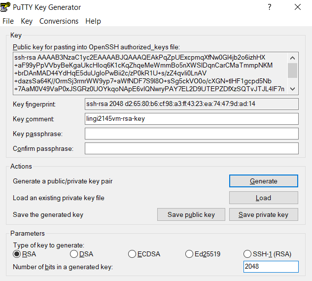

# :books: RSA configuration

**LINGI2145 Autumn, 2020** -- *Etienne Rivière, Guillaume Rosinosky and Raziel Carvajal-Gómez*

# Overview

In this tutorial, we will show you how to create a [RSA key pair](https://en.wikipedia.org/wiki/Public-key_cryptography) on the host OS and use it for automated authentication in the guest VM OS.

:warning: If you have an RSA key pair, you should use it! :warning:

If you do **not** have an RSA key pair yet, you can create one by following the instructions below.

## Linux/MacOS

On Linux/MacOS hosts, proceed as follow:

1. Open a new terminal on your laptop;
1. Use `ssh-keygen -t rsa -C ""`
1. When you are asked to provide a file name, **just confirm the option by default**.

This will produce two files: `rsa_key`, your private key, that you should never communicate to anyone, and `rsa_key.pub`, your public key.
On Mac OS and Linux, these files are by default in a hidden folder in your home directory (`~/.ssh/`).

We want to add the public key to the authorized keys on the guest OS in the VM.
Using the open terminal on the VM, proceed with the following:

1. Create the SSH folder in your home with `mkdir ~/.ssh`
1. Create a file to store authorized keys with `nano ~/.ssh/authorized_keys`
1. Copy/paste the content of the public RSA key

:bulb:
**Recall.** Press *Ctrl+O*, confirm the changes and leave the editor with *Ctrl+X*

In a new terminal, open another session into the VM OS using `ssh user@VM_IP_ADDRESS`. **Notice** that you were not asked for your password. Keep this session open, we will need it for the next section.

## Windows

On Windows hosts, proceed as follow:

### RSA Key generation with PuTTYgen

1. Install the [Putty SSH client](https://www.chiark.greenend.org.uk/~sgtatham/putty/latest.html)
1. Launch the PuTTYgen application (comes with the installer for PuTTY).
1. Click on the *Generate* button in the *Actions* section of the window.
1. You will be instructed to move the mouse cursor around within the PuTTY Key Generator window as a randomizer to generate the private key (see image below).

1. After a little delay, the key information will appear:

1. In the *key comment* box, write down some info to remind you the purpose of the key (e.g.: lingi2145vm-rsa-key). It is good practice to also set a passphrase for accessing an RSA private key, but for the purpose of this tutorial, you can leave the field empty.
1. Click on *Save private key*.
1. Copy the content in the box under *Key / Public key for pasting into OpenSSH authorized_keys file*: this is the public key you should be using. Make sure you copy all the content!

:warning: You can click *Save public key* as well, but take note: The format PuTTYgen uses when it saves the public key is incompatible with the OpenSSH authorized_keys files used on Linux servers! :warning:

### Add public key to guest VM

To configure the public key into your VM, proceed as follow:

1. Login in your VM by opening an SSH connection with PuTTY. Use regular credentials.
1. Create the SSH folder in your home with `mkdir ~/.ssh`
1. Create a file to store authorized keys with `nano ~/.ssh/authorized_keys`
1. Copy/paste the content of the public RSA key.
1. Save the file and exit the editor.
1. Logout the current SSH connection.

#### Configuring PuTTY with your private RSA key

The final step consists in configuring PuTTY to use the private key file when connecting to your VM:

1. Open PuTTY.
1. Navigate to Connection > SSH > Auth.
1. Click Browse... under Authentication parameters / Private key file for authentication, locate the private key you stored before (\*.ppk) and click Open.
1. Enter your VM IP address under Session (e.g.: `user@VM_IP_ADDRESS`).
1. Finally, click Open again to log into the remote server without typing the password! :wink:
