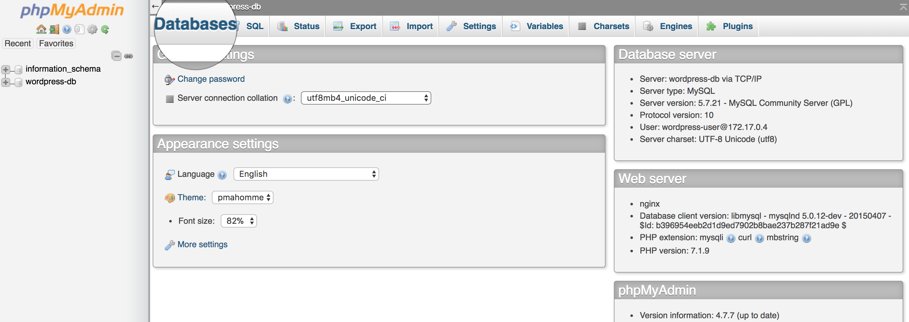

# :books: Lab Session 2: Docker Containers

**LINGI2145 Autumn, 2020** -- *Etienne Rivière, Guillaume Rosinosky and Raziel Carvajal-Gómez*

## Objectives

This tutorial teaches you how to:

1. Install Docker on the Operating System (OS) of a Virtual Machine (VM);
1. Use basic Docker commands to deploy containers;
1. Create your first Docker image and deploy an instance of this image;
1. Deploy a Web hosting service (Wordpress) using Docker containers.

:bulb: **Recall.**
We encourage you to follow the tutorial solo.

:bulb: **Recall.**
This tutorial requires you to complete some exercises that are tagged with this icon :pencil2:

## Prerequisites

In the [previous tutorial](../01_VirtualMachines/README.md#launching-multiple-vms), you created a VM image and configured its OS to allow password-less SSH connections from your laptop.
We will use this VM image in this tutorial. Follow these steps according to the situation that fits you:

1. **I complete the tutorial about VMs and deploy Wordpress.** You will use the first clone (VM called: `myvm-clone`) to install Docker. Remove the server MySQL as follows: `sudo apt-get remove mariadb-server`
1. **I complete only the tutorial about VMs.** You will use the first clone (VM called: `myvm-clone`) to install Docker.
1. **I did not complete the tutorial about VMs,** Complete this first tutorial until the section where you create a clone of your VM ([link here](../01_VirtualMachines/README.md#log-on-the-vm-clone)).

:pencil2: Start the VM `myvm-clone` in headless mode. Wait for it to boot, obtain its IP address, and connect to it using SSH.

### Install Docker

Installing Docker on Debian requires adding a repository to the `apt` package manager.
Follow the [official document](https://docs.docker.com/install/linux/docker-ce/debian/#install-using-the-repository), and complete all steps of Section **Set up the repository**.

You can now install and test Docker as follows:

1. Update the list of APT repositories with `sudo apt-get update`;
1. Install packages required for Docker with `sudo apt-get install -y docker-ce docker-ce-cli containerd.io`;
1. Test Docker with `sudo docker run hello-world`. You should see the following output:

    ``` text
    Hello from Docker!
    This message shows that your installation appears to be working correctly.

    To generate this message, Docker took the following steps:
     1. The Docker client contacted the Docker daemon.
     2. The Docker daemon pulled the "hello-world" image from the Docker Hub.
        (amd64)
     3. The Docker daemon created a new container from that image which runs the
        executable that produces the output you are currently reading.
     4. The Docker daemon streamed that output to the Docker client, which sent it
        to your terminal.

    To try something more ambitious, you can run an Ubuntu container with:
     $ docker run -it ubuntu bash

    Share images, automate workflows, and more with a free Docker ID:
     https://hub.docker.com/

    For more examples and ideas, visit:
     https://docs.docker.com/get-started/
    ```

1. By default, Docker does not allow regular users to run commands. To avoid using `sudo` before every Docker command, we can add the user to the corresponding group:

    1. Add `user` to the `docker` group using `sudo usermod -aG docker ${USER}`;
    1. Update changes with `newgrp docker`;
    1. Run (again) `docker run hello-world`.
        - :bulb: **Note that** you do not have use docker as root anymore.

**That's it**, we are now ready to start learning Docker!

## Lightweight virtualization with Docker

Docker uses operating-system level virtualization to run applications inside *Linux containers*.
This type of virtualization is also often called *containerization*.

### Containers and images

A *container* is an instance of an executable package (also known as *container image* or simply image) that stores all configuration files to run one application. For example, the `hello-world` container image is itself built on a minimalistic GNU/Linux distribution together with an executable script to print a welcome message.

Running `docker run hello-world` instructs the Docker daemon to:

1. Look-up the image `hello-world` locally. If it is not available locally, the image is pulled from [Docker Hub](https://hub.docker.com/), the repository of Docker images.

    :bulb: You can confirm that the `hello-world` image is now stored in local with `docker images`.

1. Create a container (instance of an image) and execute a command therein. As mention before, in this case the command calls a script that prints a welcome message.

1. The execution of the container stops when the called command returns.

### Build new images

In Docker you can build images by reading instructions from a configuration file, commonly named as *Dockerfile*.
This file contains several instructions to build the environment and start an application.
The `docker build` command reads a Dockerfile and executes these instructions in the order they appear.

In a new folder, create a file named `Dockerfile` (no extension) and add the following content:

``` dockerfile
# this is a Docker image of a minimalistic GNU/Linux distribution
FROM alpine

# set the working directory (inside the container)
WORKDIR /usr/hello

# store version of OS in a file
RUN echo "$(uname -v)!" > os_version.txt

# this instruction sets an environment variable
ENV CURRENT_DIR "/usr/hello"

# CMD is the instruction to run when a container starts; note that the
#   previously-set environment variables can be used.
CMD echo -e "Welcome to $(cat ${CURRENT_DIR}/os_version.txt)\nYour location is `pwd`."
```

<!-- :bulb: **Hint.**
You can create a new file with content directly from the terminal using `cat > Dockerfile`, pasting the content, and pressing Ctrl+D. -->

In your guest OS you can now create a Docker image with `docker build -t image-hello .`.
This command looks for the file `Dockerfile` in the current directory, and the option `-t` names the image.
You can confirm that `image-hello` is now part of your local catalog of images with `docker images`.

:bulb: **Hint.**
Read more about the best practices of writing Dockerfiles in [this link](https://docs.docker.com/develop/develop-images/dockerfile_best-practices/).

### Create containers

You can now run a container from the previously-built image: `docker run image-hello`.
As specified by the `CMD` line in the Dockerfile, when the container boots a welcome message is sent to the standard output.
When the command terminates, the container terminates.
In general, containers keep running applications in the background and we have to terminate them explicitly.
You can see the status of containers running on your host with `docker ps -a`.

### Common Docker commands

To see all available Docker commands type `docker --help`.
You can also consult the [description of base commands](https://docs.docker.com/engine/reference/commandline/docker/)).

## Deploying Wordpress with Docker

We will see how to use Docker to deploy WordPress, just as we did in the first tutorial second part but in a simpler and more programmatic manner (note: You should follow this section even if you did not complete the second part of the first tutorial).

Instead of deploying services on guest OSs (as seen in tutorial 1), we will now have one container running a MySQL server and a second container hosting a Web server with Wordpress.

### Deploying a MySQL server

As before, we will use MariaDB as MySQL server. There is already a Docker image for MariaDB (more details in [this link](https://hub.docker.com/_/mariadb/)), we will simply use this image to create the DB for Wordpress.

The following Dockerfile sets the root password for MariaDB and creates an empty DB.

``` Dockerfile
# we rely on the image of MariaDB
FROM mariadb

# overwrite the root password
ENV MYSQL_ROOT_PASSWORD mariadb

# create an empty DB
ENV MYSQL_DATABASE wordpress
```

:bulb: **Note.**
Any environment variable set in a Dockerfile is available in its container.

:pencil2: **Exercise.**
Create an image using the previous Dockerfile and name it `web-db`.

Once you create the `web-db` image you may run a new container out of it with `docker run -d web-db` -- the `-d` flag tells docker to run the container in the background.

:pencil2: **Exercises.**

1. List all running containers;
1. Copy the container name;
1. You may get an interactive terminal to the container with `docker exec -it CONTAINER_IDENTIFIER bash`;
1. Get the list of databases within the container;
1. Leave the interactive terminal pressing the keys **Ctrl+d**.

You may also get the logs of the container execution with `docker logs CONTAINER_IDENTIFIER`. To conclude this section, terminate the container with `docker stop CONTAINER_IDENTIFIER`.

### Deploy WordPress

We have shown you how to create containers from a Dockerfile. It is also possible to instantiate a containerized application in the `docker run` command adding other options (like setting environment variables).
This is the case of the Wordpress image for Docker (more details in [this link](https://hub.docker.com/_/wordpress/)).

In this section we show you how to instantiate a container running Wordpress and link it with your MariaDB container.

:pencil2: Relaunch the `web-db` a MariaDB container in the background.

#### Run Wordpress

We can now instantiate a Wordpress container using the following command (note that every option is explained below):

``` bash
# run a WordPress container in the background
docker run -d \
    # forward TCP traffic at port 80 of the guest OS (before colon)
    # to port 80 inside the container (after colon)
    -p 80:80 \
    # link this container with the mysql service running on the container: web-db-container
    --link web-db-container:mysql \
    # share the password to access the DB
    -e WORDPRESS_DB_PASSWORD=mariadb \
    # a container is an instance of the Wordpress Docker image
    wordpress
```

<!-- :bulb: **Recall.**
The `wordpress` image is pulled from the Docker repository. -->

That's it: in a Web browser on your laptop you should be able to see the Wordpress Welcome page by typing the IP address of the guest OS running on your VM.

## :pencil2: Exercise: Add a web interface for MySQL

We want to add a second HTTP server, PHPMyAdmin, offering a web interface to administrate MySQL (or MariaDB) servers.
We will use PHPMyAdmin, a free software tool written in PHP.
We can use the phpMyAdmin image ([available here](https://hub.docker.com/r/phpmyadmin/phpmyadmin/)) from the Docker repository and connect it to our DB container.

Follow the instructions at the link we provide to create a container of PHPMyAdmin. You can create a Dockerfile or instantiate the image in a single command (as shown in the previous section).

Then, run a container of the PHPMyAdmin image, link it with the container running MariaDB and make port 8081 available to access PHPMyAdmin from your web browser.

You can now see and manage your SQL databases via a your web browser as shown below.



**Log in using the root credentials of MariaDB!**
You should be able to see the `wordpress` DB in the list of databases, and explore its content.

### Cleaning up the local setup

- Stop all the containers with `docker stop $(docker ps -aq)`
- Delete the containers with `docker rm $(docker ps -aq)`

## Final comments

:checkered_flag: **Congratulations, you made it !**
You now have the basics of how to deploy applications with Docker.
For further reading, we invite you to complete the Get started tutorial of Docker ([available here](https://docs.docker.com/get-started/part2/)).
