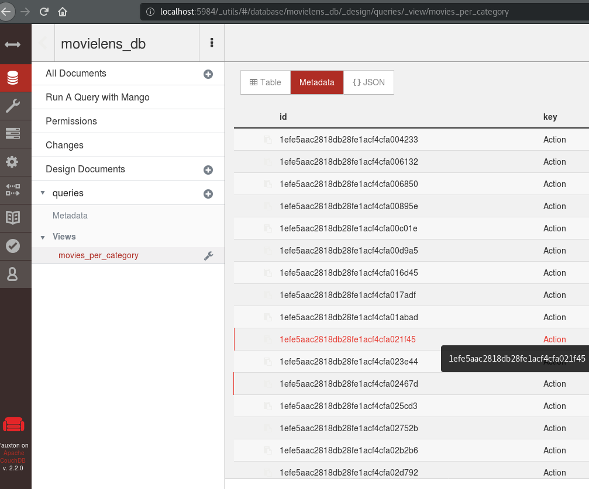
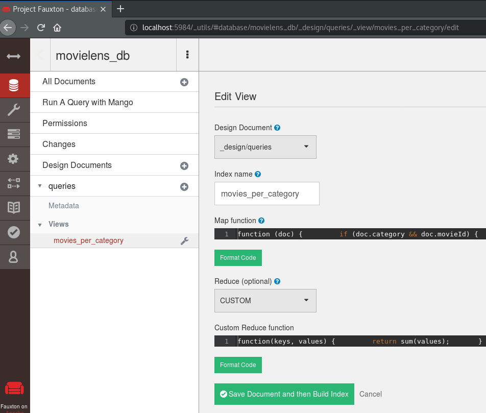
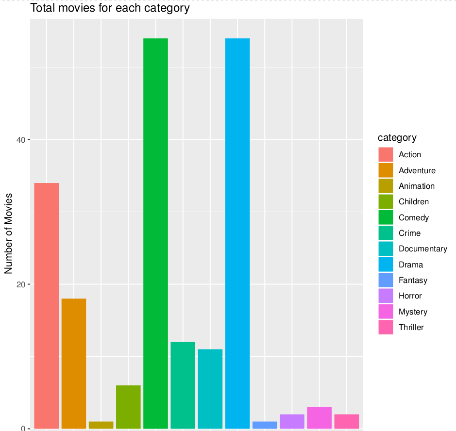

# :books: Lab session: MapReduce with CouchDB

**LINGI2145 Autumn, 2020** -- *Etienne Rivière, Guillaume Rosinosky and Raziel Carvajal-Gómez*

## Objectives

In this tutorial, you will use the MapReduce interface of CouchDB for querying user-generated data.
The tutorial follows a use case based on an open dataset.

:warning: We ask you to complete several tasks, based on what you have learn in previous tutorials.
These tasks are tagged with the symbol :pencil2:

## MapReduce in a Nutshell

MapReduce is a programming model for dealing with [parallelizable problems](https://en.wikipedia.org/wiki/Embarrassingly_parallel) over large data sets.
Two procedures ("map" and "reduce") are specified by the user and the others are implicitly handled by the execution framework.

First, the **map** procedure extracts information of interest from the source data.
It runs for each input partition of the data set (e.g. each file or each source key).
It outputs this information of interest (the value) for a specific category (the intermediate key).
For instance, a map function could select all users with write privileges from the logs of a Revision Control System (RCS).
The aim of the second phase, using the **reduce** procedure, is to summarize the data of interest for each category of interest (the intermediate key); this could be for instance getting the average number of registered users in one week in the RCS example.

In CouchDB, the MapReduce principle can be used to query data.
The combination of the two procedures map and reduce in CouchDB is called a **view**.
We will show the use of Fauxton, the built-in Web interface of CouchDB, to implement a view following a concrete example.

## Use Case: Rating of Movies

As a member of the Netflix Movie Organization (NEMO), you are in charge of analyzing a dataset providing the rating reviews of a large collection of movies.
You have to determine which movies titles and/or genres are most relevant to be added to your video streaming platform.
You are provided with a sample of the Open Source dataset of [MovieLens](https://grouplens.org/datasets/movielens/), a web service where users rank movies.
This dataset is in form of a Docker image of CouchDB where stored objects follow this format:

```json
{
  "_id": "b8bd5181d1d7abe0e79affe6f3000122",
  "_rev": "1-9ce950f78bdb186f467c6752613429fa",
  "movieId": 8,
  "rating": "4.5",
  "category": "Adventure"
}
```

We provide you with a YAML file (`movielens.yml`) with two services:

- **ml_db**: a CouchDB container that holds the MovieLens dataset
- **init_ml_db**: initializes the database with a sample of the MovieLens dataset

These containers run in an **attachable network**, this means that this network might be extended containers that are not listed in the YML file. You will see the utility of this network in the next exercise.

:pencil2: **Exercises**
To deploy the containers for this tutorial we will use Docker Compose, a widely-used script to build/deploy containers. Docker Compose uses the same format as Docker Swarm (Docker Swarm is based on Docker Compose). If not already present, you can install it as described in <https://docs.docker.com/compose/install/>. Then follow these steps:

1. Go in the root directory of this tutorial;
1. Run `docker-compose -f movielens.yml build`. This command builds all the needed Docker images, with the paths specified in the YML file;
1. Run `docker-compose -f movielens.yml up -d`. This command deploys your application, on your machine in the background (like `docker swarm deploy`);
1. Wait until the service **init_ml_db** have filled the CouchDB database.
    - Take a look into the logs of this service.

You can now open Fauxton by visiting the address `${IP_ADDRESS_OF_VM_RUNNING_DOCKER}:8080/_utils` in your Web browser. Please use your local IP address and not `localhost` or `127.0.0.1`.
Once you log in, select the database **movielens_db**. You can see a list of anonymous movies by clicking on "All documents", and on the "Table" (by default Metadata is selected), with the columns `_id`, `category`, `movieId`, `rating`.

- :warning: As in previous tutorials, you can access the database with the following credentials: `user=admin` & `password=admin`

The database already contains the view **movies_per_category** to compute the number of movies in each category.
You can see the output of this view by clicking on *queries >> views >> movies_per_category* right below the **Design Documents**.
This screenshot shows the expected output:



You can see the implementation of this view by clicking on the wrench icon (:wrench:) next to the view's name and then select the edit option to get this output:



The view query consists in map and reduce functions (you can click on the **Format Code** button to get a more human-readable version):

``` javascript
// Map function
function(doc) {
    if (doc.category && doc.movieId) {
        emit(doc.category, 1)
    }
}

// Reduce function
function(keys, values) {
    return sum(values);
}
```

**Map**. The map function is applied over each document stored in the database (*line 1*).
One document is valid **if an only if** the fields `category` & `movieId` are present (*line 2*), i.e. an actual movie has been categorized to some category.
Finally, the emit function (*line 3*) adds an entry of interest to the result set with the category name as key and the contribute of the current entry for our counting procedure (here, the constant `1`, i.e. each valid document in the database contributes to increment the count).

**Reduce**. The reduce function perform the final step of our computation, taking as input the result set generated by the map.
Concretely, for each unique key emitted by the map, the reduce step calculates the number of movies that has been tagged under a specific category.
To do this, the built-in function **sum** is called over the values generated by the map step.

:pencil: **Note.** CouchDB provides a set of predefined reduce implementations.
Among these, a **_sum** function is given (there are also **_count** and **_stats**).
Try to change the reduce function from the current `CUSTOM` implementation to the built-in `_sum`, and repeat the curl command above.
You should get the same output!

Corroborate the results of the query by writing down in a terminal the next command:

``` bash
curl admin:admin@${IP_ADDRESS_OF_VM_RUNNING_DOCKER}:8080/movielens_db/_design/queries/_view/movies_per_category?group=true
```

you will get an output similar to this one:

```javascript
{"rows":[
{"key":"Action","value":34},
{"key":"Adventure","value":18},
{"key":"Animation","value":1},
{"key":"Children","value":6},
{"key":"Comedy","value":54},
{"key":"Crime","value":12},
{"key":"Documentary","value":11},
{"key":"Drama","value":54},
{"key":"Fantasy","value":1},
{"key":"Horror","value":2},
{"key":"Mystery","value":3},
{"key":"Thriller","value":2}
]}
```

:pencil: **Exercise.** Now, present the result to your colleagues by drawing the results in form of a histogram using the command below, taking into account the following advice:

1. We will use a container from the image `lingi2145/movielens_plotter` to create a histogram in the directory `${PLOT_DIR}`;
1. This container should be included in the network of your Movielens application, you should look for the name of that network and set the variable `${NETWORK_NAME}` accordingly;
1. Finally, find out what's the name of the container running the CouchDB database to set the variable `${SERVICE_RUNNING_COUCHDB_WITH_PORT}`.

``` bash
PLOT_DIR=$(pwd); \
  docker run \
      -e COUCHDB_URL=admin:admin@${SERVICE_RUNNING_COUCHDB_WITH_PORT}/movielens_db \
      --volume ${PLOT_DIR}/plots:/usr/app/plots \
      --network ${NETWORK_NAME} lingi2145/movielens_plotter
```

You will find the file `plots/histogram.pdf` with a histogram of the view.



## :pencil2: Exercise: computing the ranking of movie categories

To accomplish your next mission as a member of NEMO, you will need to extrapolate which movie genres the users prefer the most by calculating the average rating of movies falling in each category.

Create a new view that implements the required map/reduce query:

1. Click on the "plus" icon (**+**) next to **queries**, right below **Design Documents** and select **New View**
1. In the field **Index name** write the name of your new view
1. Implement a suitable **Map function**.
1. Implement a suitable **Reduce function**.
1. Save the view by clicking on **Create Document and then Build Index**

:warning: **Due to a CouchDB UI bug, for an existing view edition, you must click first on the name of the view before clicking on the edit button. If not the reduce field will not be well-initialized.** :warning:

Consult the output of the query writing down in a terminal the next command:

``` bash
curl admin:admin@${IP_ADDRESS_OF_VM_RUNNING_DOCKER}/movielens_db/_design/queries/_view/${YOUR_VIEW_NAME}?group=true
```

### Next steps: programmatically load map/reduce queries in CouchDB

So far, you have been exploiting the CouchDB GUI to write map/reduce queries, so a natural question is: `how can we automatically load them in CouchDB?`.
This is an important aspect you have to take into account for the second part of the project.

Take a look at the `movielens_init_db` folder of this tutorial.
You will notice a directory named `views`, with a `user_queries.js` file.
It contains the map/reduce view of the query `movies_per_category`.

You can add your map/reduce views in this file and make them readily available in your CouchDB deployment.

### :pencil2: Exercise: add your `ranking` query to the CouchDB deployment

1. Modify the `user_queries.js` file by adding your map/reduce job implemented before.
1. Rebuild the `movielens_init_db` container.
1. Redeploy your services and make sure the view is automatically loaded in CouchDB.

## Final comments

:checkered_flag: **Congratulations, you made it !**
You now have the basics of MapReduce with CouchDB.
For further reading, we invite you read the official documentation about views in CouchDB ([available here](https://docs.couchdb.org/en/stable/ddocs/views/intro.html#introduction-to-views)).
